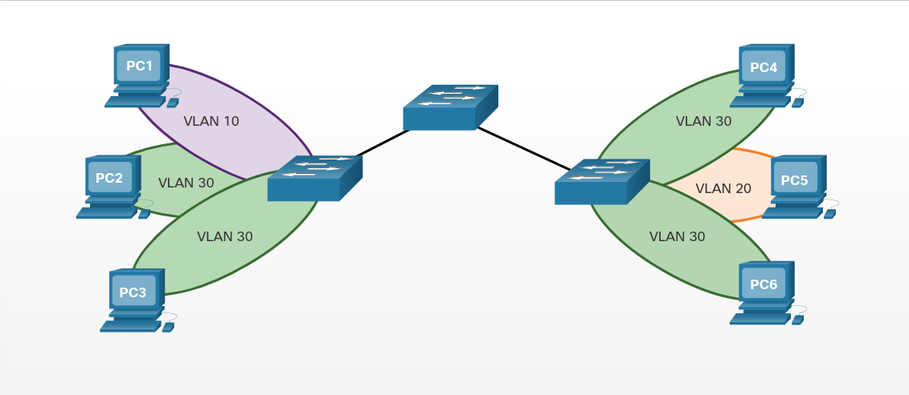
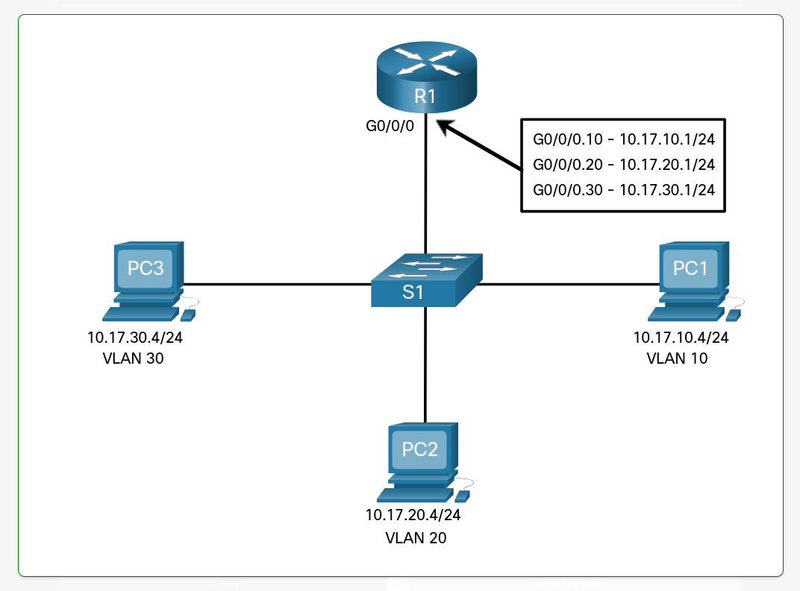
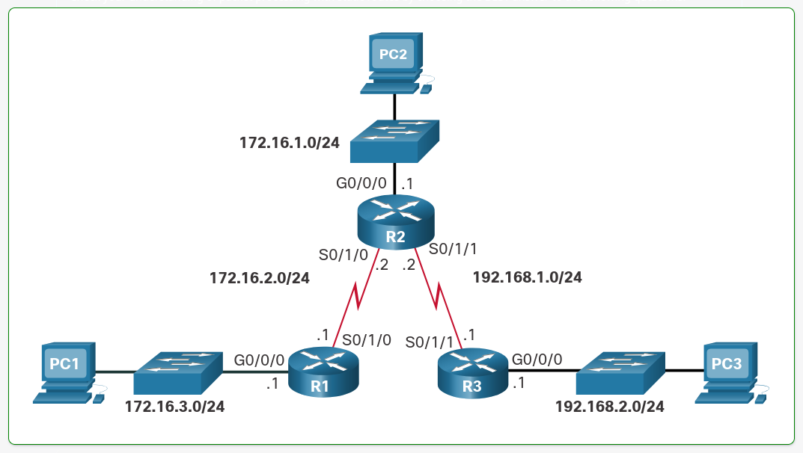

# CCNA2 Questions
Questions from each CCNA2 module from Netacad  

# Module 1: Basic Device Configuration
## 1.5 Verify Directly Connected Networks
Which command will display a summary of all IPv6-enabled interfaces on a router that includes the IPv6 address and operational status?
- ~~`show ip interface brief`~~
- ~~`show ipv6 route`~~
- ~~`show running-config interface`~~
- `show ipv6 interface brief`

When verifying routes, what code is used to identify directly connected routes in the routing table?
- C 
- ~~D~~
- ~~L~~
- ~~R~~

Which command will display packet flow counts, collisions, and buffer failures on an interface?
- `show interface`
- ~~`show ip interface`~~
- ~~`show running-config interface`~~

An IPv6-enabled interface is required to have which type of address?
- ~~Loopback~~
- ~~Global unicast~~
- Link-local 
- ~~Static~~

What character is used to enable the filtering of commands?
- Pipe `|`
- ~~Comma `,`~~
- ~~Colon `:`~~
- ~~Semicolon `;`~~

Which filtering expression will show all output lines starting from the line mathing the filtering expression?
- ~~Section~~
- Begin
- ~~Include~~

## 1.6 Module Quiz - Basic Device Configuration
Which tasks can be accomplished by using the command history feature (Choose two). 
- ~~View a list of commands entered in a previous session~~
- ~~Recall up to 15 command lines by default~~ 
- Set the command history buffer size
- Recall previously entered commands
- ~~Save command lines in a log file for future reference~~

Which statement describes the system LED operation on Cisco Catalyst switches? 
- If the LED is blinking green, the system is operating normally
- ~~If the LED is amber, the system is not powered on~~ 
- ~~If the LED is blinking amber, the switch is performing POST~~ 
- If the LED is amber, the system is receiving power, but it is not functioning properly

What type of Ethernet cable would be used to connect one switch to another switch when neither switch supports the auto-MDIX feature
- ~~Straight-through~~ 
- Crossover
- ~~Coaxial~~ 
- ~~Rollover~~

What advantage does SSH offer over Telnet?
- Encryption
- ~~More connection lines~~ 
- ~~Connection-oriented services~~
- ~~Username and password authentication~~

A network administrator has configured VLAN 99 as the management VLAN and has configured it with an IP address and subnet mask. The administrator issues the `show interface vlan 99` command and notices that the line protocol is down. Which actin can change the state of the lne protocol to up? 
- Connect a host to an interface associated with VLAN 99
- ~~Configure a default gateway~~
- ~~Remove all access ports from VLAN 99~~
- ~~Configure a transport input method on the vty lines~~ 

Which statement describes SVIs?
- ~~An SVI is created automatically for each VLAN on a multilayer switch~~
- ~~Creating an SVI automatically creates an associated VLAN~~ 
- A default SVI is created for VLAN 1 for switch administration 
- ~~An SVI can only be created for the management VLAN~~ 

Which prompt is displayed when a network administrator successfully accesses the bootloader on switch to recover from a system crash? 
- ~~`System:`~~
- ~~`System#`~~
- `Switch:`
- ~~`Switch#`~~

Which router bootup sequence is correct
- ~~1\. perform the POST and load the Cisco IOS software<br/>2. locate and load the startup configuration file or enter setup mode<br/>3. locate and load the bootstrap program~~
- ~~1\. perform the POST and load the bootstrap program<br/>2. locate and load the startup configuration file or enter setup mode<br/>3. locate and load the Cisco IOS software~~
- ~~1\. perform the POST and load the startup configuration file<br/>2. locate and load the bootstrap program<br/>3. locate and load the Cisco IOS software~~
- 1\. perform the POST and load the bootstrap program<br/>2. locate and load the Cisco IOS software<br/>3. locate and load the startup configuration file or enter setup mode

What is the first action in the boot sequence when a switch is powered on?
- ~~Load the default Cisco IOS software~~ 
- ~~Load bootloader software~~
- ~~Low-level CPU initialization~~
- Load a power-on self-test program

What must an administrator have in order to reset a lost password on a router? 
- ~~A TFTP server~~
- ~~A crossover cable~~ 
- ~~Access to another router~~ 
- Physical access to the router

When configuring a switch for SSH access, what other command that is associated with the `login local` command is required to be entered on the switch?
- `enable secret *password*`
- ~~`password *password*`~~
- `username *username* secret *secret*`
- `login block-for *seconds* attempts *number* within *seconds*`

Which command will provide information about the status of all interface including the number of giants, runts, and collisions on the interface? 
- `show interfaces`
- ~~`show ip interface brief`~~
- ~~`show history`~~
- ~~`show running-config`~~

# Module 2: Switching Concepts
## 2.2 Collision and Broadcast Domains
Which port speed will be autonegotiated between a host with a 1 Gbps NIC connecting to a Cisco Catalyst 2960 switch with a 100 Mbps port? 
- ~~10 Mbps~~
- 100 Mbps
- ~~1 Gbps~~
- ~~10 Gbps~~

Which device separates broadcast domains? 
- ~~Access Point~~ 
- ~~Hub~~
- Router 
- ~~Switch~~

Which two special characteristics do LAN switches use to alleviate network congestion? (Choose two.)
- Fast port speeds
- Fast internal switching 
- ~~Low port densities~~
- ~~Small frame buffers~~

## 2.3 Module Practice and Quiz
Which statement is true about broadcast and collision domains? 
- ~~Adding a router to a network will increase the size of the collision domain~~
- ~~The size of the collision domain can be reduced by adding hubs to a network~~ 
- ~~The more interfaces a router has the larger the resulting broadcast domain~~ 
- Adding a switch to a network will increase the size of the broadcast domain 

What is one function of a Layer 2 switch 
- ~~Forwards data based on logical addressing~~ 
- ~~Duplicates the electrical signal of each frame to every port~~
- ~~Learns the port assigned to a host by examining the destination MAC address~~ 
- Determines which interface is used to forward a frame based on the destination MAC address 

What is the significant difference between a hub and a Layer 2 LAN switch? 
- ~~A hub divides collision domains, and a switch divides broadcast domains~~ 
- A switch creates many smaller collision domains, and a hub increases the size of a single collision domain 
- ~~Each port of a hub is a collision domain, and each port of a switch is a broadcast domain~~ 
- ~~A hub forwards frames, and a switch forwards only packets~~ 

What will a Cisco LAN switch do if it receives an incoming frame and the destination MAC address is not listed in the MAC address table? 
- ~~Drop the frame~~ 
- ~~Send the frame to the default gateway address~~ 
- ~~Use ARP to resolve the port that is related to the frame~~ 
- Forward the frame out all ports except the port where the frame is received 

Which switch characteristic helps alleviate network congestion when a 10 Gbps port is forwarding data to a 1 Gbps port? 
- ~~Fast internal switching~~ 
- ~~High port density~~ 
- ~~Fast port speeds~~ 
- Frame buffering

Which switching method makes use of the FCS value?
- ~~Broadcast~~ 
- ~~Cut-through~~
- ~~Large frame buffer~~
- Store-and-forward

What does the term "port density" represents for an Ethernet switch?
- ~~The memory space that is allocated to each switch port~~ 
- The number of available ports
- ~~The numbers of hosts that are connected to each switch port~~ 
- ~~The speed of each port~~ 

Which information does a switch use to keep the MAC address table information current?
- ~~The destination MAC address and the incoming port~~
- ~~The destination MAC address and the outgoing port~~ 
- ~~The source and destination MAC address and the incoming port~~
- ~~The source and destination MAC address and the outgoing port~~ 
- The source MAC address and the incoming port 
- ~~The source MAC address and the outgoing port~~

Which two statements are true about half-duplex and full-duplex communications? (Choose two.)
- ~~Full duplex offers 100 percent potential use of the bandwidth~~
- ~~Half duplex has only one channel~~ 
- ~~All modern NICs support both half-duplex and full-duplex communication~~ 
- Full duplex allows both ends to transmit and receive simultaneously
- Full duplex increases the effective bandwidth

Which type of address does a switch use to build the MAC address table?
- ~~Destination IP address~~ 
- ~~Source IP address~~ 
- ~~Destination MAC address~~ 
- Source MAC address

Which option correctly describes a switching method? 
- ~~Cut-through: makes forwarding decision after receiving the entire frame~~
- ~~Store-and-forward: forwards the frame immediately after examining its destination MAC address~~
- ~~Cut-through: provides the flexibility to support any mix of Ethernet speeds~~   
- Store-and-forward: ensures that the frame is free of physical and data-link errors

Which network device can serve as a boundary to divide a Layer 2 broadcast domain? 
- Router 
- ~~Ethernet bridge~~ 
- ~~Ethernet hub~~ 
- ~~Access point~~

What is the purpose of frame buffers on a switch? 
- ~~They provide a basic security scan on received frames~~ 
- ~~They provide temporary storage of the frame checksum~~
- ~~They execute checksum values before transmission~~ 
- They hold traffic, thus alleviating network congestion 

Which network device can be used to eliminate collisions on an Ethernet network? 
- ~~Firewall~~
- ~~Hub~~ 
- ~~Router~~ 
- Switch

# Module 3: VLANs
## 3.1 Overview of VLANs
True or False? VLANs improve network performance by segmenting broadcast domains 
- True
- ~~False~~ 

True or False? VLANs can improve security by isolating sensitive data from the rest of the network
- True 
- ~~False~~

Which type of VLAN is assigned to 802.1Q trunk ports to carry untagged traffic? 
- ~~Default~~ 
- Native 
- ~~Data~~ 
- ~~Management~~

True or False? It is the best practice to configure the native VLAN as VLAN 1
- ~~True~~ 
- False

Which is true of VLAN 1? (Choose all that apply.)
- All switch ports are assigned to VLAN 1 by default 
- The native VLAN is VLAN 1 by default 
- The management VLAN is VLAN 1 by default 
- VLAN 1 cannot be renamed of deleted

> All of these are true  

## 3.2 VLANs in a Multi-Switched Environment 
Refer to the image. PC1 sends an ARP broadcast frame. Which PC will receive the ARP broadcast frame?
- ~~PC2~~
- ~~PC3~~
- PC4
- ~~PC5~~
- ~~PC6~~

 

Refer to the image. PC2 sends an ARP broadcast frame. Which PC will receive the ARP broadcast frame? (Choose all that apply.)
- ~~PC1~~
- PC3
- PC4
- ~~PC5~~
- PC6

 

Refer to the image. PC3 sends an ARP broadcast frame. Which PC will receive the ARP broadcast frame? 
- ~~PC1~~
- ~~PC2~~
- ~~PC4~~
- PC5
- ~~PC6~~

 

## 3.5 Dynamic Trunking Protocol 
True or False? DTP is an open standard IEEE protocol that specifies auto negotiation of switch trunk links 
- ~~True~~ 
- False

What is the default switchport mode for Cisco Catalyst switches? 
- ~~Access~~ 
- ~~Trunk~~
- Dynamic auto 
- ~~Dynamic desirable~~

True or False? Two switchports on a link both configured as dynamic auto will successfully negotiate a trunk
- ~~True~~
- False

Which tro DTP modes will form a trunk with an interface that is configured as dynamic auto? (Choose two.)
- ~~Access~~
- Trunk
- ~~Dynamic auto~~
- Dynamic desirable

## 3.6 Module Practice and Quiz
What happens to a port that is associated with VLAN 10 when the administrator deletes VLAN 10 from the switch? 
- The port becomes inactive
- ~~The port goes back to the default VLAN~~
- ~~The port automatically associates itself with the native VLAN~~
- ~~The port creates the VLAN again~~

In which memory location are the VLAN configurations of normal range VLANs sorted on a Catalyst switch?
- Flash
- ~~NVRAM~~
- ~~RAM~~
- ~~ROM~~

An administrator is investigating a failure on a trunk link between a Cisco switch and a switch from another vendor. After a few `show` commands, the administrator notices that the switches are not negotiating a trunk. What is a probable cause for this issue? 
- ~~Both switches are in trunk mode~~
- ~~Both switches are in nonegotiate mode~~ 
- Switches form other vendors do no support DTP
- ~~DTP frames are flooding the entire network~~

What is the purpose of the `vlan.dat` file on a switch 
- ~~It holds the running configuration~~ 
- ~~It holds the saved configuration~~ 
- It holds the VLAN database
- ~~It holds the operating system~~

What is the purpose of setting the native VLAN separate from data VLANs?
- ~~The native VLAN is for carrying VLAN management traffic only~~
- ~~The security of management frames that are carried in the native VLAN can be enhanced~~ 
- A separate VLAN should be used to carry uncommon untagged frames to avoid bandwidth contention on data VLANs
- ~~The native VLAN is for routers and switches to exchange their management information, so it should be different from data VLANs~~

When a Cisco switch receives untagged frames on a 802.1Q trunk port, which VLAN ID is the traffic switched to by default? 
- ~~Unused VLAN ID~~
- Native VLAN ID 
- ~~Data VLAN ID~~ 
- ~~Management VLAN ID~~

A network administrator is determining the best placement of VLAN trunk links. Which two types of point-to-point connections utilize VLAN trunking? (Choose two.)
- Between two switches that utilize multiple VLANs
- ~~Between a switch and a client PC~~
- Between a switch and a server that has an 802.1Q NIC
- ~~Between a switch and a network printer~~
- ~~Between tho switches that share a common VLAN~~

What are three primary benefits of using VLANs? (Choose three.)
- Security
- ~~A reduction in the number of trunk links~~
- Cost reduction
- ~~End user satisfaction~~
- Improved IT Staff efficiency

On a Cisco switch, where is extended range VLAN information stored 
- Running configuration file
- ~~Startup configuration file~~
- ~~NVRAM~~
- ~~Flash~~

In which location are the normal range VLANs stored on a Cisco switch by default? 
- Flash memory
- ~~Startup-config~~
- ~~Running-config~~
- ~~RAM~~

Which distinct type of VLAN is used by an administrator to access and configure a switch?
- ~~Default VLAN~~
- ~~Native VLAN~~
- ~~Data VLAN~~
- Management VLAN

For what reason would a network administrator use the `show interfaces trunk` command on a switch? 
- To view the native VLAN
- ~~To examine DTP negotiations as it occurs~~
- ~~To verify port association with a particular VLAN~~
- ~~To display an IP address for any existing VLAN~~

Where is the `vlan.dat` file stored on a switch? 
- ~~In RAM~~
- ~~In NVRAM~~
- In flash memory
- ~~On the externally attached storage media or internal hard drive~~

If an organization is changing to include Cisco IP phones in its network, what design feature must be considered to ensure voice quality? 
- ~~Voice traffic needs to be tagged with the native VLAN~~
- A separate VLAN is needed for voice traffic
- ~~Additional switch ports that are dedicated to Cisco IP phones are required~~
- ~~Voice traffic and data traffic require separate trunk links between switches~~ 

A Cisco switch currently allows traffic tagged with VLANs 10 and 20 across trunk port Fa0/5. What is the effect of issuing a `switchport trunk allowd vlan 30` command on Fa0/5?
- ~~It allows VLANs 1 to 30 on Fa0/5~~
- ~~It allows VLANs 10, 20 and 30 on Fa0/5~~
- It allows only VLAN 30 on Fa0/5
- ~~It allows a native VLAN of 30 to be implemented on Fa0/5~~

# Module 4: Inter-VLAN Routing
## 4.1 Inter-VLAN Routing Operation 
Refer to the images. Which statements best describe the different types of inter-VLAN routing solutions? (Choose all that apply.)  

Scenario A  
   
Scenario B  
  
Scenario C  
  

- ~~Scenario B and C are both Router-on-a-stick inter-VLAN routing~~
- Scenario A is a Layer 3 inter-VLAN solution 
- ~~Scenario B is a Layer 3 inter-VLAN solution~~
- ~~Scenario A is a legacy inter-VLAN solution~~
- Scenario B is a legacy inter-VLAN solution 
- Scenario C i a router-on-a-stick inter-VLAN solution

## 4.4 Troubleshoot Inter-VLAN Routing
You are troubleshooting an inter-VLAN issue on a switch and need to verify that the subinterfaces are in the routing table. Which inter-VLAN routing troubleshooting command would you use to do this?  
- ~~`show interfaces`~~
- ~~`show interfaces *interface_id* switchport`~~ 
- ~~`show ip interface brief`~~
- `show ip route`
- ~~`show vlan`~~

You are troubleshooting an inter-VLAN issue on a switch and need to check the list of VLANs and their assigned ports. Which inter-VLAN routing troubleshooting command would you use to do this?
- ~~`show interfaces`~~
- ~~`show interfaces *interface_id* switchport`~~
- ~~`show ip interface brief`~~
- ~~`show ip route`~~
- `show vlan`

You are troubleshooting an inter-VLAN issue on a switch and need to verify the status of an access port and its access mode VLAN. Which troubleshooting command would you use to do this?
- ~~`show interfaces`~~
- `show interfaces *interface_id* switchport`
- ~~`show ip interface brief`~~
- ~~`show ip route`~~
- ~~`show vlan`~~

You are troubleshooting an inter-VLAN issue on a switch and need to verify the status and IP address of all interfaces in condensed format. Which inter-VLAN routing troubleshooting command would you use to do this? 
- ~~`show interfaces`~~
- ~~`show interfaces *interface_id* switchport`~~
- `show ip interface brief`
- ~~`show ip route`~~
- ~~`show vlan`~~

## 4.6 Module Practice and Quiz 
A PC is to access a web server on another network. Which inter-VLAN method will provide the highest bandwidth on Layer 3 and also provide a default gateway for the PC? 
- ~~Router on a stick~~
- Multilayer switch with routing enabled 
- ~~Trunked interface between the router and the switch~~ 
- ~~Multiple physical interfaces on the router, all connected to a Layer 2 switch~~

Which scalable method must be implemented in order to provide inter-VLAN routing on a switched network with more than 1000 VLANs? 
- ~~Configuring static routes on a Layer 2 switch device~~  
- Routing traffic internally to a Layer 3 switch device
- ~~Connecting each physical router interface to a different physical switch port, with each switch port assigned to a different VLAN~~ 
- ~~Connecting a router interface to a switch port that is configured in trunk mode to route packets between VLANs, with each VLAN assigned to a router subinterface~~

When configuring a router as part of a router-on-a-stick inter-VLAN routing topology, where should the IP address be assigned? 
- ~~To the interface~~ 
- To the subinterface 
- ~~To the SVI~~ 
- ~~To the VLAN~~

A small college uses VLAN 10 for the classroom network and VLAN 20 for the office network. What is needed to enable communication between these two VLANs while using legacy inter-VLAN routing?
- A router with at least two LAN interface should be used 
- ~~Two groups of switches are needed, each with ports that are configured for one VLAN~~ 
- ~~A router with one VLAN interface is needed to connect to the SVI on a switch~~ 
- ~~A switch with a port that is configured as trunk is needed to connect to a router~~ 

What is a disadvantage of using multilayer switches for inter-VLAN routing? 
- ~~Multilayer switches have higher latency for Layer 3 routing~~ 
- Multilayer switches are more expensive than router-on-a-stick implementations
- ~~Spanning tree must be disabled in order to implement routing on a multilayer switch~~ 
- ~~Multilayer switches are limited to using trunk links for Layer 3 routing~~ 

Which tpe of inter-VLAN communication design requires the configuration of multiple subinterfaces? 
- Router on a stick 
- ~~Routing viac a multilayer switch~~ 
- ~~Routing for the management VLAN~~ 
- ~~Legacy inter-VLAN routing~~

What is a disadvantage of using router-on-a-stick inter-VLAN routing? 
- ~~Does not support VLAN-tagged packets~~ 
- ~~Requires the use of more physical interfaces than legacy inter-VLAN routing~~ 
- Does not scale well beyond 50 VLANs
- ~~Requires the use of multiple router interfaces configured to operate as access links~~

What is the meaning of the number 10 in the `encapsulation dot1Q 10 native` router subinterface command? 
- ~~The interface number~~ 
- ~~The subinterface number~~ 
- ~~The subnet number~~ 
- The VLAN ID

While configuring inter-VLAN on multilayer switch, a network administrator issues the `no switchport` command on an interface that is connected to another switch. What is the purpose of this command? 
- To create a routed port for a single network 
- ~~To provide a static trunk link~~
- ~~To create a switched virtual interface~~ 
- ~~To provide an access link that tags VLAN traffic~~ 

A network administrator enters the following command sequence on a Cisco 3560 switch. What is the purpose of these commands?   
```  
Switch(config)# interface g0/1
Switch(config-if)# no switchport
```
- ~~To shut down the g0/1 port~~ 
- To make the g0/1 port a routed port 
- ~~To enable the g0/1 port as a switch virtual interface~~ 
- ~~To enable the g0/1 port as a bridge virtual interface~~

What operational mode should be used on a switch port to connect it to a router for router-on-a-stick inter-VLAN routing? 
- Trunk
- ~~Access~~ 
- ~~Dynamic auto~~
- ~~Dynamic desirable~~

Which sentence correctly describes the SVI inter-VLAN routing method? 
- ~~Subinterfaces have to be created~~ 
- ~~The encapsulation type must be configured on the SVI~~ 
- An SVI is needed for each VLAN 
- ~~A physical interface is needed for every VLAN that is created~~ 

How is traffic routed between multiple VLANs on a multilayer switch? 
- ~~Traffic is routed via physical interfaces ~~
- Traffic is routed via internal VLAN interfaces 
- ~~Traffic is broadcast out all physical interfaces~~ 
- ~~Traffic is routed via subinterfaces~~

What is required to perform router-on-a-stick inter-VLAN routing? 
- ~~A Layer 2 switch that is configured with multiple trunk ports~~ 
- ~~A router with multiple physical interfaces~~ 
- ~~A multilayer switch~~ 
- A router that is configured with multiple subinterfaces 

An administrator was troubleshooting a router-on-a-stick topology and concluded that the problem was related to the configuration of VLANs on the router subinterfaces. Which two commands can the administrator use in the router to identify the problem? (Choose two.)
- ~~`show controllers`~~
- `show ip interface`
- ~~`show ip protocols`~~
- `show running-config`
- ~~`show vlan`~~

# Module 5: STP Concepts
## 5.1 Purpose of STP
Which statement describes STP? 
- ~~STP is a Layer 2 routing protocol~~
- ~~STP is a Layer 3 routing protocol for Ethernet LANs~~
- STP is a Layer 2 loop prevention protocol for Ethernet LANs
- ~~STP is a Layer 3 loop prevention protocol for IP networks~~

Without STP on the Ethernet LAN, which three types fo frames could cause a catastrophic loop in the network (Choose three.)
- ~~Unicast~~ 
- Unknown unicast
- Multicast
- Broadcast

What device is elected by the Spanning Tree Algorithm? All other switches determinate a single least-cost path to this device 
- Root bridge
- ~~Dedicated bridge~~
- ~~Default gateway~~
- ~~Core switch~~

## 5.2 STP Operations
By default (without any configuration on a switch), what will determine which switch is the root bridge? 
- ~~The bridge priority~~ 
- ~~The extended system ID~~
- The MAC address of the switch
- ~~The bridge ID~~

The root bridge will be the switch with the 
- Lowest bridge ID
- ~~Highest bridge ID~~
- ~~Lowest port priority~~ 
- ~~Highest port priority~~

The port closest to the root bridge in terms of least overall cost (best path) to the root bridge is the 
- ~~Designated port~~ 
- ~~Blocked port or non-designated port~~
- Root port 
- ~~Routed port~~

The port on the segment (with two switches) that has the lowest path cost to the root bridge is the
- Designated port
- ~~Blocked port or non-designated port~~ 
- ~~Root port~~ 
- ~~Routed port~~

Which of the following ports will forward Ethernet frames? (Choose two.)
- Designated port 
- ~~Blocked port or non-dedicated port~~
- Root port

The sum of individual port costs along the path from the switch to the root bridge is known as the 
- ~~Least cost path~~
- ~~Shortest path cost~~ 
- ~~Best path cost~~
- Root path cost

How often does a switch send a BPDU? 
- Every 2 seconds 
- ~~Every 15 seconds~~ 
- ~~Every 20 seconds~~
- ~~Only when there is a change in the topology~~

## 5.3 Evolution of STP 
Which three STP port states are merged into the RSTP discarding port state? (Choose three.)
- Disabled
- Blocking 
- Listening
- ~~Learning~~
- ~~Forwarding~~

Which protocol was designed to bring faster convergence to STP?
- ~~PortFast~~
- RSTP
- ~~PVST~~
- ~~MSTP~~

Which technology solves the problem of a device being unable to get an IPv4 address form DHCP server due to STP forwarding delay times? 
- PortFast
- ~~BPDU guard~~
- ~~PVST~~
- ~~MSTP~~

## 5.4 Module Practice and Quiz
Which port state will switch ports immediately transition to when configured for PortFast?
- ~~Listening~~
- ~~Learning~~
- Forwarding
- ~~Blocking~~

After the election of the root bridge has been completed, how will switches find the best paths to the root bridge?
- ~~Each switch will analyze the sum of the hops to reach the root and use the path with the fewest hops~~
- ~~Each switch will analyze the BID of all neighbors to reach the root and use the path through the lowest BID neighbors~~
- ~~Each switch will analyze the port states of all neighbors and use the designated ports to forward traffic to the root~~
- Each switch will analyze the usm of all port costs to reach the root and use the path with the lowest cost

Which is the default STP operation mode on Cisco Catalyst switches? 
- ~~RSTP~~
- PVST+
- ~~MST~~
- ~~MSTP~~
- ~~Rapid PVST+~~

What value determines the root bridge when all switches connected by trunk links have default STP configurations?
- ~~VLAN ID~~
- MAC address
- ~~Extended systemID~~
- ~~Bridge priority~~

During the implementation of Spanning Tree Protocol, all switches are rebooted by the network administrator. What is the first step of the spanning-tree election process? 
- ~~Each switch with a lower root ID that its neighbor will not send BPDUs~~
- All the switches send out BPDUs advertising themselves as the root bridge
- ~~Each switch determines the best path to forward traffic~~
- ~~Each switch determines what port to block to prevent a loop form occurring~~

Which two concepts relate to a switch port that is intended to have only end devices attached and intended never to be used to connect to another switch? (Choose two.)
- ~~Bridge ID~~
- Edge port
- ~~Extended system ID~~
- PortFast
- ~~PVST+~~

Which three port states are used by PVST+? (Choose three.)
- Discarding
- ~~Blocking~~
- ~~Trunking~~
- ~~Listening~~
- Learning
- Forwarding

When PVST is running over a switched network, which port state can participate in BPDU frame forwarding based on BPDUs received, but does not forward data frames? 
- ~~Blocking~~
- Listening
- ~~Forwarding~~
- ~~Disabled~~

Which STP port role is adopted by a switch port if there is no other port with a lower cost to the root bridge? 
- ~~Designated port~~
- Root port 
- ~~Alternate~~
- ~~Disabled port~~

Which two statements describe a switch port that is configured with PortFast? (Choose two.)
- ~~The switch port immediately transitions from the listening to the forwarding state~~
- The switch port immediately transitions from blocking to the forwarding state
- The switch port should never receive BPDUs
- ~~The switch port immediately processes any BPDUs before transitioning to the forwarding state~~
- ~~The switch port sends DHCP requests before transitioning to the forwarding state~~

What is one way to correct a spanning tree failure? 
- ~~Replace all instances of STP with RSTP~~
- ~~Insert redundant links to replace the failed STP links~~
- ~~Replace the cables on failed STP links~~
- Manually remove redundant links in the switched network

What additional information is contained in the 12-bit extended system ID of BPDU? 
- ~~MAC address~~
- VLAN ID
- ~~IP address~~
- ~~Port ID~~

An administrator is troubleshooting a switch and wants to verify if it is a root bridge. What command can be used to do this? 
- `show spanning-tree`
- ~~`show running-config`~~
- ~~`show startup-config`~~
- ~~`show vlan`~~

What is an accurate description of redundancy? 
- ~~Configuring a router with a complete MAC address database to ensure that all frames can be forwarded to the correct destination~~
- ~~Configuring a switch with proper security to ensure that all traffic forwarded through an interface is filtered~~
- ~~Designing a network to use multiple virtual devices to ensure that all traffic uses the best path through the internetwork~~
- Designing a network to use multiple paths between switches to ensure there is no single point of failure

# Module 6: EtherChannel
## 6.1 EtherChannel Operation 
Which are benefits of EtherChannel technology? (Choose all that apply.)
- Fault-tolerance
- Load sharing
- Increased bandwidth
- Link redundancy

> All of these are true  

True or False? FastEthernet and GigabitEthernet links can be combined into a single EtherChannel
- ~~True~~
- False

True or False? PAgP and LACP are both Cisco-proprietary link-aggregation protocols
- ~~True~~
- False

Which three are PAgP interface modes? (Choose three.)
- On
- Auto
- ~~Active~~
- ~~Passive~~
- Desirable

Which PAgP interface mode will initiate negotiation with other interfaces? 
- ~~On~~ 
- Desirable
- ~~Auto~~

Which combinations of PAgP modes will form an EtherChannel? (Choose all that apply.)
- Auto > desirable
- ~~Desirable > on~~
- ~~Auto > on~~
- On > on
- ~~On > active~~
- ~~Active > passive~~

## 6.4 Module Practice and Quiz
An EtherChannel link using LACP was formed between two switches, S1 and S2. While verifying the configuration, which mode combination could be utilized on both switches? 
- ~~S1-on and S2-passive~~
- ~~S1-passive and S2-passive~~
- ~~S1-on and S2-active~~
- S1-passive ans S2-active

When a range of ports is being configured for EtherChannel, which mode will configure PAgP so that it initiates the EtherChannel negotiation? 
- ~~Active~~
- ~~Auto~~
- Desirable 
- ~~Passive~~

Which three interface parameters must match for an EtherChannel to form? (Choose three.)
- Allowed VLANs
- ~~EtherChannel mode~~
- Native VLAN
- ~~PortFast mode~~
- ~~Spanning-tree state~~
- Trunking mode

What are three advantages of using EtherChannel technology? (Choose three.)
- ~~EtherChannel uses multiple logical links to provide redundancy~~
- Configuration tasks can be done on the EtherChannel interface
- There is no need to upgrade links to faster connections to increase bandwidth
- ~~Load balancing is not needed with EtherChannel~~
- ~~The Spanning Tree Protocol shuts down the unused interfaces in the bundle to avoid loops~~
- A spanning three recalculation is not required when a single link within the channel goes down

A network administrator is configuring an EtherChannel link between two physical ports on a switch. Which statement describes the result when one of the physical ports fails? 
- ~~The EtherChannel link fails~~
- ~~An STP recalculation is needed~~
- ~~The EtherChannel stops transmitting data until it is restarted~~
- The EtherChannel continues transmitting data with reduced bandwidth

When EtherChannel is implemented, multiple physical interfaces are bundled into which type of logical connection? 
- ~~Interface range~~
- ~~Loopback~~
- ~~VLAN interface~~
- Port channel

When a range of ports is being configured for EtherChannel by the use of PAgP, which mode will form the bundled channel only if the port receives PAgP packets from another device? 
- ~~Active~~
- Auto
- ~~Desirable~~
- ~~Passive~~

Which two load balancing methods can be implemented with EtherChannel technology? (Choose two.)
- ~~Destination MAC to destination IP~~
- ~~Destination IP to destination MAC~~
- Source MAC to destination MAC
- Source IP to destination IP
- ~~Destination MAC to source MAC~~
- ~~Destination IP to source IP~~

Which function is provided by EtherChannel? 
- ~~Spreading traffic across multiple physical WAN links~~
- ~~Dividing the bandwidth of a single link into separate time slots~~
- ~~Enabling traffic from multiple VLANs to travel over a single Layer 2 link~~
- Creating one logical link by using multiple physical links between two LAN switches

Which statement is true about EtherChannel technology? 
- ~~All configuration tasks must be done on the individual ports in the EtherChannel link~~
- EtherChannel uses existing switch ports
- ~~Link must be upgraded to support EtherChannel~~
- ~~STP does not run on redundant EtherChannel links~~

Which two mode combinations would result in the successful negotiation of an EtherChannel? (Choose two.)
- Active; passive
- ~~Passive; auto~~
- ~~Desirable; active~~
- ~~Auto; auto~~
- Desirable; desirable
- ~~Active; on~~

Which two protocols are link aggregation protocols? (Choose two.)
- 802.3ad
- PAgP
- ~~STP~~
- ~~EtherChannel~~
- ~~RSTP~~

When a range of ports is being configured for EtherChannel, which mode will configure LACP so that it initiates the EtherChannel negotiation? 
- Active
- ~~Auto~~
- ~~Desirable~~
- ~~Passive~~

What will happen if a network administrator puts aport that is part of an EtherChannel bundle into a different VLAN that the other ports in that bundle? 
- ~~The EtherChannel bundle will stay up only if PAgP is used~~
- ~~The EtherChannel bundle will stay up only if LACP is used~~
- ~~The EtherChannel bundle will stay up if either PAgP or LACP is used~~
- ~~The EtherChannel bundle will stay up if the ports were configured with no negotiation between the switches to form the EtherChannel~~
- The EtherChannel will fail

When a range of ports is being configured for EtherChannel, which mode will configure LACP on a port only if the port receives LACP packets form another device
- ~~Active~~
- ~~Auto~~
- ~~Desirable~~
- Passive

# Module 7: DHCPv4
## 7.1 DHCPv4 Concepts 
Which message is sent by a DHCPv4 client to initiate the lease obtaining process? 
- DHCPDISCOVER
- ~~DHCPOFFER~~
- ~~DHCPREQUEST~~
- ~~DHCPACK~~

Which two DHCPv4 messages are sent by the server in the lease obtaining process? (Choose two.)
- ~~DHCPDISCOVER~~
- DHCPOFFER
- ~~DHCPREQUEST~~
- DHCPACK

Which two DHCPv4 messages are used in the lease renewal process? (Choose two.)
- ~~DHCPDISCOVER~~
- ~~DHCPOFFER~~
- DHCPREQUEST
- DHCPACK

## 7.4 Module Practice and Quiz
A DHCP-enabled client PC has just booted. During which two steps will the client PC use broadcast messages when communicating with a DHCP server? (Choose two.)
- DHCPDISCOVER
- ~~DHCPACK~~
- ~~DHCPOFFER~~
- DHCPREQUEST
- ~~DHCPNAK~~

An administrator issues the commands: 
```
Router(config)# interface g0/1
Router(config-if)# ip address dhcp 
```
What is the administrator trying to achieve?
- ~~Configuring the router to act as a DHCPv4 server~~
- Configuring the router to obtain IP parameters from a DHCPv4 server
- ~~Configuring the router to act as a relay agent~~
- ~~Configuring the router to resolve IP address conflicts~~

When a client is requesting an initial address lease from a DHCP server, why is the DHCPREQUEST message sent as a broadcast?
- ~~The client does not yet know the IP address of the DHCP server that sent the offer~~
- ~~The DHCP server may be on a different subnet, so the request must be sent as a broadcast~~
- ~~The client does not have a MAC address assigned yet, so it cannot send an unicast message at Layer 2~~
- The client may have received offers form multiple servers. and the broadcast serves to implicitly decline those other offers

Which DHCP IPv4 message contains the following information? 
```
Destination address: 255.255.255.255
Client IPv4 address: 0.0.0.0
Default gateway address: 0.0.0.0
Subnet mask: 0.0.0.0
```
- ~~DHCPACK~~
- DHCPDISCOVER
- ~~DHCPOFFER~~
- ~~DHCPREQUEST~~

What kind of message is sent by a DHCPv4 client requesting an IP address?
- DHCPDISCOVER broadcast message
- ~~DHCPDISCOVER unicast message~~
- ~~DHCPOFFER unicast message~~
- ~~DHCPACK unicast message~~

As a DHCPv4 client lease is about to expire, what is the message that the client sends the DHCP server? 
- ~~DHCPDISCOVER~~
- ~~DHCPOFFER~~
- DHCPREQUEST
- ~~DHCPACK~~

What is the destination IP address when an IPv4 host sends a DHCPDISCOVER message? 
- `255.255.255.255`
- ~~`224.0.0.1`~~
- ~~`0.0.0.0`~~
- ~~`192.168.1.1`~~

If more than one DHCP server is available on the local network, in which order will DHCP message be sent between a host and a DHCP server?
- ~~Request, discover, offer, acknowledgment~~
- ~~Acknowledgment, request, offer, discover~~
- Discover, offer, request, acknowledgment
- ~~Request, acknowledgment, discover, offer~~

What is the most likely scenario in which the WAN interface of a router would be configured as a DHCP client to be assigned a dynamic IP address from an ISP?
- ~~There is a web server for public access on the LAN that is attached to the router~~
- ~~The router is also the gateway for a LAN ~~
- It is a SOHO or home broadband router
- ~~The router is configured as a DHCP server~~

Which is a DHCPv4 address allocation method that assigns IPv4 addresses for a limited lease period? 
- ~~Manual allocation~~
- ~~Pre-allocation~~
- ~~Automatic allocation~~
- Dynamic allocation

What is the reason why the DHCPREQUEST message is sent as a broadcast during the DHCPv4 process? 
- To notify other DHCP server on the subnet that the IP address was leased
- ~~To notify other hosts not to request the same IP address~~
- ~~For hosts on other subnets to receive the information~~
- ~~For routers to fill their routing tables with this new information~~

How is a DHCPDISCOVER transmitted on a network to reach a DHCP server? 
- ~~A DHCPDISCOVER message is set with the IP address of the DHCP server as the destination address~~
- ~~A DHCPDISCOVER message is sent with a multicast IP address that all DHCP servers listen to as the destination address~~
- A DHCPDISCOVER message is set with the broadcast ip address as the destination address
- ~~A DHCPDISCOVER message is sent with the ip address of the default gateway as the destination address~~

Which destination IPv4 address does a DHCPv4 client use to send the initial DHCP Discover packet when the client is looking for a DHCP server? 
- ~~`127.0.0.1`~~
- ~~`224.0.0.1`~~
- `255.255.255.255`
- ~~The IP address of the default gateway~~

Under which two circumstances would a router usually be configured as a DHCPv4 client (Choose two.)
- The router is intended to be used as a SOHO gateway
- ~~The administrator needs the router to act as a relay agent~~
- ~~The router is meant tot provide IP addresses to the hosts~~
- This is an ISP requirement
- ~~The router has a fixed IP address~~

Which address does a DHCPv4 server target when sending a DHCPOFFER message to a client that makes an address request?
- ~~Client IP address~~
- Client hardware address
- ~~Gateway IP address~~
- ~~Broadcast MAC address~~

# Module 8: SLAAC and DHCPv6
## 8.1 IPv6 GUA Assignment
- Which address type is automatically created by default on a host interface when no RAs are received?
- ~~Global unicast address~~
- Link-local address
- ~~MAC address~~

Which method best describes stateless DHCP?
- ~~SLAAC only~~
- SLAAC with stateless DHCPv6 server
- ~~Stateful DHCPv6 server~~

## 8.2 SLAAC
Which two ICMPv6 messages are used in the SLAAC process? (Choose two.)
- ~~Neighbor Advertisements (NA)~~
- ~~Neighbor Solicitation (NS)~~
- Router Solicitation (RS)
- Router Advertisements (RA)

Which command must be configured on a router to enable it to join the IPv6 all-routers multicast address `ff02::2?`
- ~~`ip routing`~~
- `ipv6 unicast-routing`
- ~~`ipv6 address *ipv6_address/prefix_length*`~~
- ~~`ipv address *ipv6_address* link-local`~~

What are the flag settings when a host should use the SLAAC only option?
- A=1, M=0, O=0
- ~~A=1, M=1, O=0~~
- ~~A=1, M=0, O=1~~
- ~~A=0, M=1, O=1~~

Which ICMPv6 message is sent by a host in an attempt to locate an online IPv6 enabled router to obtain IPv6 addressing information?
- ~~Neighbor Advertisements (NA)~~
- ~~Neighbor Solicitation (NS)~~
- Router Solicitation (RS)
- ~~Router Advertisements (RA)~~

What method is used by a host to verify an IPv6 address is unique on the local network before assigning that address to an interface?
- ~~ARP~~
- DAD
- ~~PING~~
- ~~SLAAC~~

## 8.3 DHCPv6
What destinationUDP port do DHCPv6 clients use to send DHCPv6 messages?
- ~~67~~
- ~~68~~
- 547
- ~~546~~

What DHCPv6 message does a host send to look for a DHCPv6 server?
- ~~ADVERTISE~~
- SOLICIT
- ~~INFORMATION-REQUEST~~
- ~~REQUEST~~

What DHCPv6 message does a host send to the DHCPv6 server if it is using stateful DHCPv6?
- ~~ADVERTISE~~
- ~~SOLICIT~~
- ~~INFORMATION-REQUEST~~
- REQUEST

What flag settings combination is used for stateless DHCP? 
- ~~A=1, M=0, O=0~~
- ~~A=0, M=1, O=0~~
- A=1, M=0, O=1
- ~~A=0, M=1, O=1~~

What M flag setting indicates hat stateful DHCPv6 is used?
- ~~M=0~~
- M=1

## 8.4 Configure DHCPv6 Server
Which three DHCPv6 roles can a router perform? (choose all that apply.)
- DHCPv6 client
- DHCPv6 relay agent
- DHCPv6 server
- ~~DHCPv6 pool~~

Which command is not configured in stateless DHCPv6? 
- `address prefix *ipv6_address/prefix*`
- ~~`domain-name *name*`~~
- ~~`dns-server *server_address*`~~
- ~~`ipv6 dhcp server *pool_name*`~~

An IPv6-enabled router is to acquire its IPv6 GUA from another IPv6 router using SLAAC. Which interface configuration command should be configured on the client router? 
- `ipv6 address autoconfig`
- ~~`ipv6 address auto config`~~
- ~~`ipv6 address dhcp`~~
- ~~`ipv6 address dhcpv6`~~

A router is to provide DHCPv6 server services. Which command should be configured on the client facing interface?
- ~~`ipv6 enable`~~
- `ipv6 dhcp pool *pool_name*`~~
- ~~`ipv6 dhcp server *pool_name*`
- ~~`ipv6 nd other-config-flag`~~

An IPv6-enabled router is to acquire its IPv6 GUA from a DHCPv6 server. Which interface configuration command should be configured on client router? 
- ~~`ipv6 address autoconfig`~~
- ~~`ipv6 address auto config`~~
- `ipv6 address dhcp`
- ~~`ipv6 address dhcpv6`~~

Which DHCPv6 verification command would display the link-local and GUA assigned address for each active client?
- ~~`show ip dhcp pool`~~ 
- `show ipv6 dhcp binding`
- ~~`show ipv6 dhcp interface`~~ 
- ~~`show ipv6 dhcp pool`~~

Which command is configured on the client LAN interface of the DHCPv6 relay agent?
- ~~`ip helper-address`~~
- `ipv6 dhcp relay desination`
- ~~`ipv6 enable`~~
- ~~`ipv6 helper-address`~~

## Module Practice and Quiz
How does an IPv6 client ensure that it has a unique address after it configures its IPv6 address using the SLAAC allocation method?
- ~~It sends an ARP message with the IPv6 address as the destination IPv6 address~~
- ~~It checks with the IPv6 address database that is hosted by the SLAAC server~~
- ~~It contacts the DHCPv6 server via a special formated ICMPv6 message~~
- It sends an ICMPv6 Neighbor Solicitation message with the IPv6 address as the target IPv6 address

Which method would an IPv6-enabled host using SLAAC empty to learn the address of the default gateway? 
- Router advertisements that are received from the link router
- ~~Advertise messages that are received from the DHCPv6 server~~
- ~~Neighbor advertisements that are received from link neighbors~~
- ~~Reply messages that are received from the DHCPv6 server~~

What two methods can be used to generate an interface ID by an IPv6 host that is using SLAAC (Choose two.)
- EUI-64
- Random generation
- ~~Stateful DHCPv6~~
- ~~DAD~~
- ~~ARP~~

A client is using SLAAC to obtain an IPv6 address for its interface. After an address has been granted and applied to the interface, what must the client do before it can begin to use this IPv6 address?
- ~~It must send a DHCPv6 INFORMATION-REQUEST message to request the address of the DNS server~~
- ~~It must send an ICMPv6 Router Solicitation message to determine what default gateway it should use~~
- ~~It must send a DHCPv6 REQUEST message to the DHCPv6 server to request permission to use this address~~
- It must send an ICMPv6 Neighbor Solicitation message to ensure that the address is not already in use on the network

Which command should be configured on a router interface to set the router as a stateful DHCPv6 client?
- ~~`ipv6 enable`~~
- `ipv6 address dhcp`
- ~~`ipv6 address autoconfigure`~~
- ~~`ipv6 dhcp server stateful`~~

What message informs IPv6 enabled interfaces to use stateful DHCPv6 for obtaining an IPv6 address?
- The ICMPv6 Router Advertisement
- ~~The ICMPv6 Router Solicitation~~
- ~~The DHCPv6 Reply message~~
- ~~The DHCPv6 Advertise message~~

Which destination IP address is used when an IPv6 host sends a DHCPv6 SOLICIT message to locate a DHCPv6 server?
- `ff02::2`
- ~~`ff02::1`~~
- ~~`fe80::1`~~
- ~~`ff02::1:2`~~

In which alternative to DHCPv6 does a router dynamically provide IPv6 configuration information to hosts? 
- ~~ARP~~
- ~~EUI-64~~
- ~~ICMPv6~~
- SLAAC

A company implements the stateless DHCPv6 method for configuring IPv6 addresses on employee workstations. After a workstation receives messages from multiple DHCPv6 servers to indicate their availability for DHCPv6 service, which message does it send to a server for configuration information?
- ~~DHCPv6 SOLICIT~~
- ~~DHCPv6 REQUEST~~
- ~~DHCPv6 ADVERTISE~~
- DHCPv6 INFORMATION-REQUEST

What process is used in ICMPv6 for a host to verify that an IPv6 address is unique before configuring it on an interface? 
- DAD
- ~~SLAAC~~
- ~~EUI-64~~
- ~~ARP~~

What are two characteristics of the SLAAC method for IPv6 address configuration? (Choose two.)
- The default gateway of an IPv6 client on a LAN will be the link-local address of the router interface attached to the LAN
- ~~The stateful method of acquiring an IPv6 address requires at least one DHCPv6 server~~
- ~~Clients send router advertisement messages to routers to request IPv6 addressing~~
- IPv6 addressing is dynamically assigned to clients through the use of ICMPv6
- ~~Router solicitation messages are sent by the router to offer IPv6 addressing to clients~~

After booting, a client receives an ICMPv6 RA message with the `M` flag set to 0 and the `O` flag set to 1. What does this indicate?
- ~~The client should request an IPv6 address directly from a DHCPv6 server~~
- ~~The client should automatically configure an IPv6 address without contacting a DHCPv6 server~~
- The client should automatically configure an IPv6 address and then contact a DHCPv6 server for more information
- ~~The client should be statically configured with an IPv6 address because the local router does not support autoconfiguration~~

A network administrator is entering the command `ipv6 unicast-routing` to start configuring DHCPv6 operation on a router. Which statement describes the function of this command?
- It is required for sending ICMPv6 RA messages
- ~~It is required to configure stateful DHCPv6 server on the router~~
- ~~It is required to configure stateless DHCPv6 server on the router~~
- ~~It is required for enabling DNS service in DHCPv6 configuration~~

# Module 9: FHRP Concepts
## 9.1 First Hop Redundancy Protocols
What type of device routes traffic destined to network segments beyond the source network segment for which the sending note may not have explicit routing information?
- ~~Virtual router~~
- ~~Standby router~~
- Default gateway
- ~~Layer 3 switch~~

What device presents the illusion of a single router to hosts on a LAN segment but actually represents a set of routers working together?
- Virtual router
- ~~Standby router~~
- ~~Default gateway~~
- ~~Layer 3 switch~~

What device is part of a virtual router group assigned the role of alternate default gateway? 
- ~~Virtual router~~
- Standby router
- ~~Default gateway~~
- ~~Layer 3 switch~~

What device that is part of a virtual router group assigned to the role of a default gateway?
- ~~Virtual router~~
- Forwarding router
- ~~Default gateway~~
- ~~Layer 3 switch~~

Which FHRPs are Cisco-proprietary (Choose two.)
- ~~IRDP~~
- HSRP
- HSRP for IPv6
- ~~VRRPv2~~

## 9.2 HSRP
What is the default HSRP priority? 
- ~~50~~ 
- 100
- ~~150~~
- ~~255~~

True or false? If a router with a higher HSRP priority joins the network, it will take over the active router roll from an existing active router which has a lower priority
- ~~True~~
- False

During which HSRP state does an interface begin sending periodic hello messages? 
- ~~Initial~~
- ~~Listen~~
- Speak
- ~~Active~~

Which is a characteristic of the HSRP learn state?
- The router has not determined the virtual IP address
- ~~The router knows the virtual IP address~~
- ~~The router sends periodic hello messages~~
- ~~The router actively participates in the active/standby election process~~

## 9.3 Module Practice and Quiz
What is the purpose of HSRP?
- It provides a continuous network connection when a router fails
- ~~It prevents a rogue switch from becoming the STP root~~
- ~~It enables an access port to immediately transition to the forwarding state~~
- ~~It prevents malicious hosts from connecting to trunk ports~~

Which non-proprietary protocol provides router redundancy for a group of routers which support IPv4 LANs?
- ~~HSRP~~
- VRRPv2
- ~~GLBP~~
- ~~SLB~~

A network administrator is analyzing first-hop router redundancy protocols. What is a characteristic of VRRPv3?
- ~~VRRPv3 is Cisco proprietary~~
- It supports IPv6 and IPv4 addressing
- ~~It works together with HSRP~~
- ~~It allows load balancing between routers~~

What is a potential disadvantage when implementing HSRP as compared to GLBP?
- ~~HSRP does not function in a multivendor environment~~
- HSRP does not provide load balancing with multiple active routers
- ~~HSRP does not have the capability to support IPv6 addressing~~
- ~~HSRP provides default gateway failover only when the active router fails~~

A network engineer is configuring a LAN with a redundant first hop to make better use of the available network resources. Which protocol should the engineer implement?
- ~~FHRP~~
- GLBP
- ~~HSRP~~
- ~~VRRP~~

When first hop redundancy protocol are used, which two items will be shared by a set of routers that are presenting the illusion of being a single router? (Choose two.)
- ~~Hostname~~
- IP address
- ~~BID~~
- ~~Static route~~
- MAC address

In FHRP terminology, what represents a set of routers that present the illusion of a single router to host?
- ~~Standby router~~
- Virtual router
- ~~Forwarding router~~
- ~~Default gateway~~

A user needs to add redundancy to the routers in a company. What are the three options the user can use? (Choose three.)
- HSRP
- VRRP
- ~~STP~~
- ~~IPFIX~~
- ~~RAID~~
- GLBP

Which two protocols provide gateway redundancy at Layer 3? (Choose two.)
- VRRP
- ~~STP~~
- ~~PVST~~
- ~~RSTP~~
- HSRP

A network administrator is overseeing the implementation of first hop redundancy protocols. Which two protocols are Cisco proprietary? 
- HSRP
- ~~VRRP~~
- GLBP
- ~~IRDP~~
- ~~VRRPv2~~

Which statement describes a characteristic of GLBP?
- ~~It does not provide support for IPv6~~
- ~~It provides load balancing for a maximum of four gateways~~
- ~~It provides multiple virtual IP addresses and multiple virtual MAC addresses~~
- It provides automatic rerouting if any router in the group fails

A network administrator is analyzing the features that are supported by different first-hop router redundancy protocols. Which statement is a feature that is associated with GLBP?
- GLBP allows load balancing between routers
- ~~It is non-proprietary~~
- ~~It uses a virtual router master~~
- ~~It works together with VRRP~~

# Module 10: Lan Security Concepts
## 10.1 Endpoint Security
Which attack encrypts the data on hosts in an attempt to extract a monetary payment from the victim? 
- ~~DDoS~~
- ~~Data breach~~
- ~~Malware~~
- Ransomware

Which devices are specifically designed for network security? (Choose three.)
- VPN-enabled router
- NGFW
- ~~Switch~~
- ~~WLC~~
- NAC

Which device monitors SMTP traffic to block threats and encrypt outgoing messages to prevent data loss?
- ~~NGFW~~
- ESA
- ~~NAC~~
- ~~WSA~~

Which device monitors HTTP traffic to block access to risky sites and encrypt outgoing messages?
- ~~NGFW~~
- ~~ESA~~
- ~~NAC~~
- WSA

## 10.2 Access Control
Which AAA component is responsible for collecting and reporting usage data for auditing and billing purposes?
- ~~Authentication~~
- ~~Authorization~~
- Accounting

Which AAA component is responsible for controlling who is permitted to access the network?
- Authentication
- ~~Authorization~~
- ~~Accounting~~

Which AAA component is responsible for determining what the user can access?
- ~~Authentication~~
- Authorization
- ~~Accounting~~

In an 802.1X implementation, which device is responsible for relaying responses? 
- ~~Supplicant~~
- Authenticator
- ~~Router~~
- ~~Authentication server~~
- ~~Client~~

## 10.3 Layer 2 Security Threats
Which of the following mitigation techniques are used to protect Layer 3 through Layer 7 of the OSI Model? (choose three.)
- ~~DHCP snooping~~
- VPN
- Firewalls
- ~~IPSG~~
- IPS devices

Which of the following mitigation techniques prevents many types of attacks including MAC address trable overflow and HDCP starvation attacks? 
- ~~IPSG~~
- ~~DHCP snooping~~
- ~~DAI~~
- Port security

Which of the following mitigation techniques prevents MAC and IP address spoofing?
- IPSG
- ~~DHCP snooping~~
- ~~DAI~~
- ~~Port security~~

Which of the following mitigation techniques prevents ARP spoofing and ARP poisoning attacks?
- ~~IPSG~~
- ~~DHCP snooping~~
- DAI
- ~~Port security~~

Which of the following mitigation techniques prevents DHCP starvation and DHCP spoofing attacks?
- ~~IPSG~~
- DHCP snooping
- ~~DAI~~
- ~~Port security~~

## 10.4 MAC Address Table Attacks
What is the behaviour of a switch as a result of a successful MAC address table attack?
- ~~The switch will shut down~~
- ~~The switch interfaces will transition to the error-disabled state~~
- The switch will forward all received frames to all other ports within the VLAN
- ~~The switch will drop al received frames~~

What would be the primary reason a threat actor would launch a MAC address overflow attack?
- So that the threat actor can see frames that are destined for other devices 
- ~~So that the threat actor can execute arbitrary code on the switch~~
- ~~So that the switch sops forwarding traffic~~
- ~~So that legitimate hosts cannot obtain a MAC address~~

What mitigation technique must be implemented to prevent MAC address overflow attacks? 
- ~~IPSG~~
- ~~DAI~~
- Port security
- ~~DHCP snooping~~

## 10.5 LAN Attacks
A threat actor changes the MAC address of the threat actor's device to the MAC address of the default gateway. What type of attack is this? 
- Address spoofing
- ~~ARP spoofing~~
- ~~CDP reconnaissance~~
- ~~DHCP starvation~~
- ~~STP attack~~
- ~~VLAN hopping~~

A threat actor sends a BPDU message with priority 0. What type of attack is this? 
- ~~Address spoofing~~
- ~~ARP spoofing~~
- ~~CPD reconnaissance~~
- ~~DHCP starvation~~
- STP attack
- ~~VLAN hopping~~

A threat actor leases all the available IP addresses on a subnet. What type of attack is this?
- ~~Address spoofing~~
- ~~ARP spoofing~~
- ~~CPD reconnaissance~~
- DHCP starvation
- ~~STP attack~~
- ~~VLAN hopping~~

A threat actor sends a message that causes all other devices to believe the MAC address of the threat actor's device is the default gateway. What type of attack is this?
- ~~Address spoofing~~
- ARP spoofing
- ~~CPD reconnaissance~~
- ~~DHCP starvation~~
- ~~STP attack~~
- ~~VLAN hopping~~

A threat actor configures a host with the 802.1Q protocol and forms a trunk with the connected witch. What type of attack is this?
- ~~Address spoofing~~
- ~~ARP spoofing~~
- ~~CPD reconnaissance~~
- ~~DHCP starvation~~
- ~~STP attack~~
- VLAN hopping

A threat actor discovers the IOS version and IP address of the local switch. What type of attack is this?
- ~~Address spoofing~~
- ~~ARP spoofing~~
- CPD reconnaissance
- ~~DHCP starvation~~
- ~~STP attack~~
- ~~VLAN hopping~~

## 10.6 Module Practice and Quiz
What two protocols are supported on Cisco devices for AAA communications? (Choose two.)
- ~~VTP~~
- ~~LLDP~~
- ~~HSRP~~
- RADIUS
- TACACS+

Which service is enabled on a Cisco router by default that can reveal significant information about the router and potentially make it more vulnerable to attack?
- ~~HTTP~~
- CPD
- ~~FTP~~
- ~~LLDP~~

When security is a concern, which OSI Layer is considered to be the weakest link in a network system? 
- ~~Layer 4~~
- Layer 2
- ~~Layer 3~~
- ~~Layer 7~~

Which Layer 2 attack will result in a switch flooding incoming frames to all ports?
- ~~ARP poisoning~~
- ~~IP address spoofing~~
- MAC address overflow
- ~~Spanning Tree Protocol manipulation~~

Why is authentication with AAA preferred over a local database method?
- ~~It uses less network bandwidth~~
- ~~It requires a login and password combination on the console, vty lines, and aux ports~~
- It provides a fallback authentication method if the administrator forgets the username or password
- ~~It specifies a different password for each line or port~~

In a server-based AAA implementation, which protocol will allow the router to successfully communicate with the AAA server?
- ~~SSH~~
- RADIUS
- ~~TACACS~~
- ~~802.1x~~

Which Cisco solution helps prevent MAC and IP address spoofing attacks?
- ~~Port Security~~
- ~~DHCP Snooping~~
- IP Source Guard
- ~~Dynamic ARP Inspection~~

What is the purpose of AAA accounting?
- To collect and repost application usage
- ~~To determine which resources the user can access~~
- ~~To prove users are who they say they are~~
- ~~To determine which operations the user can perform~~

Which Layer 2 attack will result in legitimate users not getting valid IP addresses?
- ~~ARP spoofing~~
- DHCP starvation
- ~~IP address spoofing~~
- ~~MAC address flooding~~

Which three Cisco products focus on endpoint security solutions? (Choose three.)
- ~~IPS Sensor Appliance~~
- Web Security Appliance
- Email Security Appliance
- ~~SSL/IPsec VPN Appliance~~
- ~~Adaptive Security Appliance~~
- NAC Appliance

True or False? In the 802.1X standard, the client attempting to access th network is referred to as the supplicant
- True 
- ~~False~~

What is involved in an IP address spoofing attacks
- A legitimate network IP address is hijacked by a rogue node
- ~~A rogue node replies to an ARP request with its own MAC address indicated for the target IP address~~
- ~~A rogue DHCP server provides false IP configuration parameters to legitimate DHCP clients~~
- ~~Bogus DHCPDISCOVER messages are sent to consume all the available IP addresses on a DHCP server~~

What three services are provided by the AAA framework? (Choose three.)
- Accounting
- ~~Automation~~
- Authorization
- Authentication
- ~~Autobalancing~~
- ~~Autoconfiguration~~

Because of implemented security controls, a user can only access a server with FTP. Which AAA component accomplishes this?
- ~~Accessibility~~
- ~~Accounting~~
- ~~Auditing~~
- ~~Authentication~~
- Authorization

What mitigation plan is the best for thwarting a DoS attack that is creating a MAC address table overflow?
- ~~Disable DTP~~
- ~~Disable STP~~
- Enable port security
- ~~Place unused ports in an unused VLAN~~

# Module 11: Switch Security Configuration
## 11.6 Module Practice and Quiz
What is a recommended best practice when dealing with the native VLAN?
- ~~Turn off DTP~~
- ~~Use port security~~
- Assign it to an unused VLAN
- ~~Assign the same VLAN number as the management VLAN~~

On what switch ports should PortFast be enabled to enhance STP stability?
- All end-user ports
- ~~Only ports that attach to a neighboring switch~~
- ~~All trunk ports that are not root ports~~
- ~~Only ports that are elected as designated ports~~

Which command would be best to use on an unused switch port if a company adheres to the best practices as recommended by Cisco? 
- `shutdown`
- ~~`ip dhcp snooping`~~
- ~~`switchport port-security mac-address sticky`~~
- ~~`switchport port-security violation shutdown`~~
- ~~`switchport port-security mac address sticky *mac_address*`~~

Which two features on a Cisco Catalyst switch can be used to mitigate DHCP starvation and DHCP spoofing attacks? (Choose two.)
- Port security
- ~~Extended ACL~~
- DHCP snooping
- ~~DHCP server failover~~
- ~~Strong password on DHCP servers~~

What is the best way to prevent a VLAN hopping attack?
- ~~Disable STP on all nontrunk ports~~
- ~~Use ISL encapsulation on all trunk links~~
- ~~Use VLAN 1 as the native VLAN on trunk ports~~
- Disable trunk negotiation for trunk ports and statically set nontrunk ports as access ports

Which procedure is recommended to mitigate the chances of ARP spoofing?
- ~~Enable port security globally~~
- Enable DHCP snooping on selected VLANs
- ~~Enable DAI on the management VLAN~~
- ~~Enable IP source Guard on trusted ports~~

What are two types of switchports that are used on Cisco switches as part of the defense against DHCP spoofing attacks? (Choose two.)
- ~~Unknown port~~
- Untrusted port
- ~~Unauthorized port~~
- Trusted DHCP port
- ~~Authorized DHCP port~~
- ~~Established DHCP port~~

Which two commands can be used to enable PortFst on a switch? (Choose two.)
- `S1(config-if)# spanning-tree portfast`
- ~~`S1(config-line)# spanning-tree portfast`~~
- `S1(config)# spanning-tree portfast default`
- ~~`S1(config-if)# enable spanning-tree portfast`~~
- ~~`S1(config)# enable spanning-tree portfast default`~~

An administrator who is troubleshooting connectivity issues on a switch notices that a switch port configured for port security is in the `err-disabled` state. After verifying the cause of the violation, how should the administrator re-enable the port without disruption network operation?
- ~~Reboot the switch~~
- Issue the `shutdown` command followed by `no shutdown` command on the interface
- ~~Issue the `no switchport port-security` command, then re-enable port security~~
- ~~Issue the `no switchport port-security violation shutdown` command on the interface~~

A network administrator is configuring DHCP snooping on a switch. Which configuration command should be used first?
- `ip dhcp nooping`
- ~~`ip dhcp snooping vlan`~~
- ~~`ip dhcp snooping trust`~~
- ~~`ip dhcp snooping limit rate`~~
 
A network administrator is configuring DAI on a switch with the command `ip arp inspection validate dst-mac`. What is the purpose of this configuration command?
- ~~To check the destination MAC address in the Ethernet header against the MAC address table~~
- ~~To check the destination MAC address in the Ethernet header against the user-configured ARP ACLs~~
- To check the destination MAC address in the Ethernet header against the target MAC address in the ARP body
- ~~To check the destination MAC address in the Ethernet header against the source MAC address in the ARP body~~

Which security feature should be enabled in order to prevent an attacker from overflowing the MAC address table of a switch?
- ~~BPDU filter~~
- Port security
- ~~Storm control~~
- ~~Root guard~~

What Layer 2 attack is mitigated by disabling Dynamic Trunking Protocol?
- VLAN hopping
- ~~DHCP spoofing~~
- ~~ARP poisoning~~
- ~~ARP spoofing~~

A network administrator is configuring DAI on a switch. Which command should be used on the uplink interface that connects to a router? 
- ~~`ip arp inspection vlan`~~
- `ip arp inspection trust`
- ~~`ip dhcp snooping`~~
- ~~`spanning-tree portfast`~~

Where are dynamically learned MAC addresses stored when sticky learning is enabled with the `switchport port-security mac-address sticky` command?
- ~~ROM~~
- RAM
- ~~NVRAM~~
- ~~Flash~~

# Module 12: WLAN Concepts
## 12.1 Introduction to Wireless
Which of the following wireless networks typically uses lowe powered transmitters for short ranges?
- WPAN
- ~~WLAN~~
- ~~WMAN~~
- ~~WWAN~~

Which of the following wireless networks are specified in the IEEE 802.11 standards for the 2.4 GHz and 5 GHz radio frequencies?
- ~~WPAN~~
- WLAN
- ~~WMAN~~
- ~~WWAN~~

Which of the following is and IEEE 802.15 WPAN standard that uses a device-pairing process to communicate?
- ~~Cellular~~
- ~~WiMAX~~
- ~~WiFi~~
- Bluetooth

Which 802.11 standards exclusively use the 5 GHz radio frequency? (Choose 2)
- 802.11a
- ~~802.11g~~
- ~~802.11n~~
- 802.11ac
- ~~802.11ax~~

Which standards organization is responsible for allocating radio frequencies?
- ~~IEEE~~
- ITU-R
- ~~WiFi Alliance~~

## 12.2 WLAN Components
True or False? Laptops that do not have an integrated wireless NIC can only be attaches to the network through a wired connection
- ~~True~~
- False

Which of the following components are integrated in a wireless home router? (Choose three.)
- Access point
- Switch
- Router
- ~~Range extender~~

True or False? When you need to expand the coverage of a small network, the best solution is to use a range extender
- ~~True~~
- False

Which of the following is a standalone device, like a home router, where the entire WLAN configuration resides on the device?
- ~~Range extender~~
- Autonomous AP
- ~~Controller-based AP~~
- ~~USB Wireless NIC~~

Which of the following antennas provide 360 degrees of coverage?
- ~~Wireless NIC~~
- ~~Directional~~
- Omnidirectional
- ~~MIMO~~

## 12.3 WLAN Operation
Which wireless topology mode is used by two devices to connect in a peer-to-peer network? 
- Ad hoc
- ~~Infrastructure~~
- ~~Tethering~~

True or False? An ESS is created when two or more BSSs need to be joined to support roaming clients
- True
- ~~False~~

How many address fields are in the 802.11 wireless frame?
- ~~2~~
- ~~3~~
- 4
- ~~5~~

What is the term for an AP that openly advertises its service periodically?
- ~~Active~~
- ~~Infrastructure~~
- ~~Ad hoc~~
- Passive

What is the term for an AP that does not send a beacon, but waits for clients to send probes?
- Active 
- ~~Infrastructure~~
- ~~Ad hoc~~
- ~~Passive~~

What IP versions does CAPWAP support? 
- ~~IPv4 only~~
- ~~IPv6 only~~
- IPv4 by default, but can configure IPv6
- ~~IPv6 by default, but can configure IPv4~~

What UDP ports and IP protocols are used by CAPWAP for IPv4? (Choose three.)
- 17
- ~~136~~
- 5246
- 5247
- ~~802.11~~

What UDP ports and IP protocols are used by CAPWAP for IPv6? (Choose three.)
- ~~17~~
- 136
- 5246
- 5247
- ~~802.11~~

In the split MAC architecture for CAPWAP, which of the following are the responsibility of the AP? (Choose four.)
- ~~Authentication~~
- Packet acknowledgements and retransmissions
- Beacons and probe responses
- ~~Association and re-association of roaming clients~~
- MAC layer data encryption and decryption
- ~~Termination of 802.11 traffic on a wired interface~~
- ~~Frame translation to other protocols~~
- Frame queueing and packet prioritization

In the split MAC architecture for CAPWAP, which of the following are the responsibility of the WLC? (Choose four.)
- Authentication
- ~~Packet acknowledgements and retransmissions~~
- ~~Beacons and probe responses~~
- Association and re-association of roaming clients
- ~~MAC layer data encryption and decryption~~
- Termination of 802.11 traffic on a wired interface
- Frame translation to other protocols
- ~~Frame queueing and packet prioritization~~

True or False: DTLS is enabled by default on the control and data CAPWAP tunnels.
- ~~True~~
- False

Which of the following statements are true about modes of operation for a FlexConnect AP? (Choose two.)
- ~~In connect mode, the WLC is unreachable and the AP switches local traffic and performs client authentication locally~~
- In standalone mode, the WLC is unreachable and the AP switches local traffic and performs client authentication locally
- In connect mode, the WLC is reachable and performs all its CAPWAP functions
- ~~In standalone mode, the WLC is reachable and performs all its CAPWAP functions~~

## 12.5 Channel Management
Which of the following modulation techniques rapidly switches a signal among frequency channels? 
- ~~DSSS~~
- FHSS
- ~~OFDM~~
- ~~OFDMA~~

Which of the following modulation techniques spreads a signal over a larger frequency band? 
- DSSS
- ~~FHSS~~
- ~~OFDM~~
- ~~OFDMA~~

Which of the following modulation techniques is used in the new 802.11ax standard?
- ~~DSSS~~
- ~~FHSS~~
- ~~OFDM~~
- OFDMA

How many channels are available for the 2.4 GHz band in Europe? 
- ~~11~~
- 13
- ~~14~~
- ~~24~~

How many channels are available for the 5 GHz band? 
- ~~11~~
- ~~13~~
- ~~14~~
- 24

## 12.6 WLAN Threats
Which of the following is most likely NOT the source of a wireless DoS attack? 
- ~~Radio interference~~
- ~~Improperly configured devices~~
- Rogue AP
- ~~Malicious user~~

True or False: A rogue AP is a misconfigures AP connected to the network and a possible source of DoS attacks
- ~~True~~
- False

What type of attack is an "evil twin AP" attack? 
- ~~DoS~~
- MITM
- ~~Wireless intruder~~
- ~~Radio interference~~

## 12.7 Secure WLANs
What are the best ways to secure WLANs? (Choose two.)
- Authentication
- ~~SSID cloaking~~
- Encryption
- ~~MAC address filtering~~

Which of the following authentication methods does not use a password shared between the wireless client and the AP? 
- ~~WEP~~
- ~~WPA~~
- ~~WPA2~~
- ~~WPA3~~
- Open

Which encryption method is used by the original 802.11 specification?
- ~~AES~~
- ~~TKIP~~
- ~~AES or TKIP~~
- RC4

Which of the following encryption methods uses CCMP to recognize if the encrypted and non-encrypted bits have been altered?
- ~~RC4~~
- ~~TKIP~~
- AES

Which of the following authentication methods has the user entered and pre-shared password? (Choose two.)
- ~~Open~~
- WPA Personal
- ~~WPA Enterprise~~
- WPA2 Personal
- ~~WPA2 Enterprise~~

## 12.8 Module Practice and Quiz
In the context of mobile devices, what does the term tethering involve? 
- Connecting a mobile device to another mobile device or computer to share a network connection
- ~~Connecting a mobile device to a hands-free headset~~
- ~~Connecting a mobile device to a 4G cellular network~~
- ~~Connecting a mobile device to a USB port on a computer in order to charge the mobile device~~

Which feature of 802.11n wireless points allows them to transmit data at faster speeds than previous versions of 802.11 Wi-Fi standards did?
- ~~SPS~~
- ~~WPS~~
- MIMO
- ~~MITM~~

Which method of wireless authentication is currently considered to be the strongest?
- ~~WEP~~
- ~~WPA~~
- WPA2
- ~~Open~~
- ~~Shared key~~

Which parameter is commonly used to identify a wireless network name when a home wireless AP is being configured? 
- ~~Ad hoc~~
- ~~BESS~~
- ~~ESS~~
- SSID

Which characteristic describes a wireless client operating in active mode? 
- ~~Ability to dynamically change channels~~
- Mut know the SSID to connect to an AP
- ~~Must be configured for security before attaching to an AP~~
- ~~Broadcasts probes that request the SSID~~

Which IEEE standard operates at wireless frequencies in both the 5 GHz and 2.4 GHz ranges?
- 802.11n
- ~~802.11g~~
- ~~802.11b~~
- ~~802.11a~~

Which statement describes an autonomous access point?
- ~~It is used for networks that require a large number of access points~~
- It is a standalone access point
- ~~It is server-dependent~~
- ~~It is managed by a WLAN controller~~

Which two roles are typically performed by a wireless router that is used in a home or small business? (Choose two.)
- ~~Repeater~~
- Access point
- ~~WLAN controller~~
- Ethernet switch
- ~~RADIUS authentication server~~

Which protocol and port numbers are used by both IPv4 and IPv6 CAPWAP tunnels? (Choose two.)
- UDP
- ~~TCP~~
- ~~ICMP~~
- 5246 and 5246
- ~~17 and 163~~

If three 802.11b access points need to be deployed in close proximity, which three frequency channels should be used? (Choose three.)
- 1
- ~~3~~
- ~~5~~
- 6
- ~~8~~
- 11

Which type of telecommunication technology is used to provide Internet access to vessels at sea?
- Satellite
- ~~WiMax~~
- ~~Cellular~~
- ~~Municipal WiFi~~

Which wireless network topology is being configured by a technician who is installing a keyboard, a mouse, and headphones, each of which uses Bluetooth?
- Ad hoc mode
- ~~Hotspot~~
- ~~Infrastructure mode~~
- ~~Mixed mode~~

Which type of wireless topology is created when two or more Basic Service Sets are interconnected by Ethernet?
 - ~~IBISS~~
 - ~~BSS~~
 - ~~WiFi Direct~~
 - ESS
 - ~~Ad hoc WLAN~~

 What Wi-Fi management frame is regularly broadcast by APs to announce their presence?
- ~~Probe~~
- Beacon
- ~~Association~~
- ~~Authentication~~

# Module 13: WLAN Configuration
## 13.5 Module Practice and Quiz
A user is configuring a wireless access point and wants to prevent any neighbors from discovering the network. What action does the user need to take?
- Disable SSID broadcast
- ~~Enable WPA encryption~~
- ~~Configure DMZ settings~~
- ~~Configure a DNS server~~

When a wireless network in a small office is being set up, which type of IP addressing is typically used on the networked devices?
- ~~Public~~
- Private
- ~~Network~~
- ~~Wireless~~

A user has just purchased a generic home router and would like to secure it. What should be done to help secure the wireless home router?
- Change the default administrator password
- ~~Set a private IPv4 network for the internal network~~
- ~~Change the default SSID~~
- ~~Allow only IPv6 traffic to enter the router~~

Which protocol could be used by a company to monitor devices such as a wireless LAN controller (WLC)?
- ~~NTP~~
- ~~PAT~~
- SNMP
- ~~SSH~~

When configuring a Cisco 3500 series wireless LAN controller (WLC) for WPA2 Enterprise WLAN, what has to be created on the WLC before creating the new WLAN?
- ~~A new SSID~~
- ~~A security module~~
- ~~A security policy~~
- A VLAN for the wireless network

What is a DHCP scope as it relates to a WLAN configured on the WLC controller?
- ~~A corporate plan for allocation of IP addresses for wireless clients~~
- A pool of IP addresses for WLAN clients
- ~~Security rules associated with DHCP for WLANs~~
- ~~The distance allotted for wireless clients that can receive IP addressing information~~

Why would a technician configure a passphrase for a WLAN on a wireless router? 
- ~~To protect someone form changing the configuration~~
- To configure wireless client authentication
- ~~To protect someone from cabling directly to the router and accessing the router~~
- ~~To protect the SSID from being changed~~

A customer installs a wireless access point at home in the closet next to the kitchen. The customer mentions that the wireless communication performance seems degraded when the cordless phone or the microwave oven is in use. What is the possible reason for this degradation?
- ~~The access point is close to walls~~
- ~~The cordless phone joins the WLAN and shares the available bandwidth~~
- The wireless signal is in the same radio frequency range as the household device are in
- ~~The access point is on the same electrical circuit as the phone base unit and microwave over are~~
- ~~The surge of electricity when a microwave oven is in use disrupts the operation of the access point~~

What functionality is required on routers to provide remote workers with VoIP and videoconferencing capabilities?
- ~~IPsec~~
- QoS
- ~~VPN~~
- ~~PPPoE~~

A wireless router is displaying the IP address of `192.168.0.1`. What could this mean?
- ~~The NAT function is not working on the wireless router~~
- The wireless router still has the factory default IP address
- ~~Dynamic IP address allocation has been configured on the router and is functioning correctly~~
- ~~The wireless router has been configured to use the frequencies on channel 1~~

A laptop cannot connect to a wireless access point. Which two troubleshooting steps should be taken first? (Choose two.)
- Ensure that the wireless NIC is enabled
- ~~Ensure that the laptop antenna is attached~~
- ~~Ensure that the wireless SSID is chosen~~
- Ensure that the correct network media is selected
- ~~Ensure that the NIC is configured for the proper frequency~~

In setting up a small office network, the network administrator decides to assign private IP addresses dynamically to workstations and mobile devices. Which feature must be enabled on the company router in order for office devices to access the internet?
- ~~QoS~~
- NAT
- ~~UPnP~~
- ~~MAC filtering~~

What is the difference between autonomous APs that operate in a home environment and controller-based APs that operate in a corporate environment?
- ~~Autonomous APs incorporate functions of a router, switch, and AP into one device~~
- ~~Autonomous APs do not support PoE~~
- Controller-based APs can be automatically configured and managed by a WLAN controller
- ~~Controller-based APs are known as lightweight APs and require an initial configuration to operate~~

Which WLC tab would a network administrator typically use to see a summary view of the most heavily used WLANs including the number of clients using a particular WLAN?
- ~~Commands~~
- ~~Controller~~
- Monitor
- ~~WLANs~~

Users o nan IEEE 802.11n network are complaining of slow speeds. The network administrator checks the AP and verifies it is operating properly. What can be done to improve the wireless performance in the network? 
- Split the wireless traffic between the 802.11n 2.4 GHz band and the 5 GHz band
- ~~Change the authentication method on the AP~~
- ~~Switch to an 802.11g AP~~
- ~~Set the AP to mixed mode~~

# Module 14: Routing Concepts
## 14.1 Path Determination
What table does a router use to determine how to forward an IP packet? 
- ~~ARP table~~
- ~~MAC address table~~
- ~~Neighbor cache~~
- Routing table

What action will a router take on a packet with a destination IP address that is on a remote network?
- ~~It will forward the packet directly to the device with the destination IP address of the packet~~
- It will forward the packet to a next-hop router
- ~~It will forward the packet to an Ethernet switch~~
- ~~It will drop the packet~~

Which of the following routes may be found in a routing table? (Choose all that apply.)
- Directly connected networks
- Static routes
- Dynamic routing protocol routes
- Default route

> All four are correct

What is used to determine the minimum number of far-left bits that must match between the prefix in the route entry and the destination IP address
- Prefix length in the routing table entry
- ~~Prefix length of the destination IP address~~
- ~~The classfull address of the network address~~

## 14.2 Packet Forwarding
If a router needs to send an ARP Request for the destination IPv4 address of the packet, this means the packet will be forwarded
- ~~To a next-hop router~~
- To the device with the destination IPv4 address of the packet

If a router needs to send an ARP Request for the IPv4 address in one of its route entries, this means the packet will be forwarded
- To a next-hop router 
- ~~To the device with the destination IPv4 address of the packet~~

Which packet forwarding method is used by default on Cisco routers?
- ~~Process switching~~
- ~~Fast switching~~
- Cisco Express Forwarding
- ~~Ethernet switching~~

## 14.4 IP Routing Table
Which routing table principle is not correct?
- ~~Every router makes its decisions alone, based on the information it ahs in its own routing table~~
- ~~The fact that on router has certain information in its routing table does not mean that other routers have the same information~~
- Routing information about a path from one network to another also provides routing information about the reverse, or return path

Which route entry would be used for packet with a destination IP address that matches an IP address of one of the router interfaces?
- ~~`C` for Directly Connected~~
- `L` for Local
- ~~`S` for Static~~
- ~~Depends on the source of the route~~

What type of network is accessed by a single route and the router has only one neighbor? 
- Stub network
- ~~Directly connected network~~
- ~~Next-hop network~~
- ~~Local network~~

Which two route sources have the ability to automatically discover a new best path when there is a change in the topology (Choose two.)
- ~~Static route~~
- OSPF
- EIGRP
- ~~Default route~~

True or False? A default route can only be a static route
- ~~True ~~
- False

A network administrator configures a static route for the same destination network that was learned automatically by the router using OSPF. Which route will be installed and why?
- ~~Static route because it has a lower metric~~
- Static route because it has a lower administrative distance
- ~~OSPF route because it has a lower metric~~
- ~~OSPF route because it has a lower administrative distance~~

## 14.5. Static and Dynamic routing
Which type of routing automatically adapts to topology change
- ~~Static routes~~
- Dynamic routing protocols
- ~~Both static routes and dynamic routing protocols~~

What type of routing is typically used with a stub network?
- Static routes
- ~~Dynamic routing protocols~~

What metric is used by OSPF to determine the best path?
- ~~Hop count~~
- Cost
- ~~Bandwidth and delay~~
- ~~Decided by the network administrator~~

What term is used to describe routing over two or more paths to a destination with equal cost metrics? 
- ~~Equal path selection~~
- ~~Equal packet forward ~~
- Equal cost load balancing
- ~~Equal cost routing~~

## 14.6 Module Practice and Quiz
Which feature on a Cisco router permits the forwarding of traffic for which there is no specific route?
- ~~Next-hop~~
- Gateway of last resort
- ~~Route source~~
- ~~Outgoing interface~~

Which three advantages are provided by static routing? (Choose three.)
- Static routing does not advertise over the network, thus providing better security
- ~~Configuration of static routes it error-free~~
- ~~Static routes scale well as the network grows~~
- Static routing typically uses less network bandwidth and fewer CPU operations than dynamic routing does
- The path a static route uses to send data is known
- ~~No intervention is required to maintain changing route information~~

What are two functions of dynamic routing protocols? (Choose two.)
- To maintain routing tables
- ~~To assure low router overhead~~
- ~~To avoid exposing network information~~
- To discover the network
- ~~To choose the path that is specified by the administrator~~

What is an advantage of using dynamic routing protocols instead of static routing? 
- ~~Easier to implement~~
- ~~More secure in controlling routing updates~~
- ~~Fewer router resource overhead requirements~~
- Ability to actively search for new routes if the current path becomes unavailable

Which value represents the "trustworthiness" of a route and is used to determine which route to install into the routing table when there are multiple routes toward the same destination?
- ~~Routing protocol~~
- ~~Outgoing interface~~
- ~~Metric~~
- Administrative distance

Which packet-forwarding method does a router use to make switching decisions when it is using a forwarding information base and an adjacency table?
- ~~Fast switching~~
- Cisco Express Forwarding
- ~~Process switching~~
- ~~Flow process~~

Which type of route would typically be used on a border router so that devices inside the company could access the Internet?
- ~~Static~~
- Default
- ~~Summary~~
- ~~Directly connected~~

What are two functions of a router? (Choose two.)
- A router connects multiple IP networks
- ~~It controls the flow of data via the use of Layer 2 addresses~~
- It determines the best path to send packets
- ~~It provides segmentation at Layer 2~~
- ~~It builds a routing table based on ARP requests~~

When a router learns that multiple paths are available to a destination network from the same routing protocol, which factor is considered by a router to choose the best path to forward a packet? 
- The lowest metric
- ~~The order of paths on the routing table~~
- ~~The fastest bandwidth of existing interfaces~~
- ~~The reliability value of the neighboring routers~~

Which two route source codes are automatically created with a routing table whenever a router interface is configured with an IP address and activated? (Choose two.)
- `C`
- ~~`O`~~
- `L`
- ~~`S`~~
- ~~`D`~~

The output of the `show ip route` command contains the following entry:  
`S 10.2.0.0[1/0] via 172.16.2.2`  
What value is indicated by the 1 in the `[1/0]` portion of the output?
- ~~Metric~~
- ~~Number of hops~~
- Administrative distance
- ~~Interface ID through which the network can be reached~~

Which type of static route creates a gateway of last resort?
- Default static route
- ~~Floating static route~~
- ~~Standard static route~~
- ~~Summary static route~~

What are two common types of static routes in routing tables? (Choose two.)
- A default static route
- ~~A built-~~in stati route by IOS
- A static route to a specific network
- ~~A static route shared between two neighboring routers~~
- ~~A static route converted form a route that is learned through a dynamic routing protocol~~

What are two reasons why an administrator might choose to use static routing rather than dynamic routing? (Choose two.)
- ~~Static routing is easier to maintain in large networks~~
- Static routing is more secure
- ~~Static routing is more scalable~~
- Static routing uses less router processing and bandwidth
- ~~Static routing does not require complete knowledge of the whole network~~

What address and prefix length is used when configuring an IPv6 default static route?
- `::/0`
- ~~`::1/128`~~
- ~~`0.0.0.0/0`~~
- ~~`ff02::1/8`~~

# Module 15: IP Static Routing
## 15.1. Static Routes
Which two methods can be used to identify the next hop in a static route? (Choose tho.)
- ~~Destination interface~~
- Next hot IP address
- ~~Destination network address~~
- Exit interface
- ~~Source IP address~~

Which IPv4 static route statement is true?
- ~~The destination network is identified using the network address and wildcard mask~~
- ~~The `distance` keyword is used to create fully specified static route~~
- ~~The source network is identified using the network address and wildcard mask~~
- Using the exit interface only is a common in a point-to-point configuration

How is the destination network in an IPv6 static route identified?
- Using an IPv6 prefix and prefix length
- ~~Using an IPv6 prefix and subnet mask~~
- ~~Using an IPv6 prefix and wildcard mask~~
- ~~Using an IPv6 prefix only~~

## 15.6. Module Practice and Quiz
A network administrator configures a router by the command `ip route 0.0.0.0 0.0.0.0 209.165.200.226`. What is the purpose of this command?
- ~~To forward all packets to the device with IP address `209.165.200.226`~~
- ~~To add a dynamic route for the destination network `0.0.0.0` to the routing table~~
- ~~To forward packets destined for the network `0.0.0.0` to the device with IP address `209.165.200.226`~~
- To provide a route to forward packets for which there is no route in the routing table

Which type of static route that is configured on a router uses only the exit interface?
- ~~Recursive static route~~
- Directly connected static route
- ~~Fully specified static route~~
- ~~Default static route~~

A network administrator uses the command `ip route 172.18.0.0 255.255.0.0 s0/0/1` to configure a floating static route on a router. That route will function as a backup route to reach the EIGRP learned network `172.18.0.0/16`. After this configuration, the EIGRP route is removed from the routing table even though EIGRP is still functioning properly. Why is the static route not functioning as intended?
- ~~The next hop neighbor IP address is not configured~~
- The administrative distance value is not high enough on the static route
- ~~The destination network is incorrectly configured~~
- ~~The network mask is incorrectly configured~~

What type of static route is created when the next-hop IP address and exit interface are specified?
- ~~Recursive static route~~
- ~~Directly connected static route~~
- Fully specified static route
- ~~Floating static route~~

What is the correct syntax of a floating static route? 
- ~~`ip route 209.165.200.228 255.255.255.248 serial 0/0/0`~~
- `ip route 209.165.200.228 255.255.255.248 10.0.0.1 120`
- ~~`ip route 0.0.0.0 0.0.0.0 serial 0/0/0`~~
- ~~`ip route 172.16.0.0 255.248.0.0 10.0.0.1`~~

Which static route statement shows a recursive IPv6 static route?
- ~~`ipv6 route 0::/0 s0/0/0`~~
- ~~`ipv6 route 0::/0 s0/0/0 254`~~
- ~~`ipv6 route 2001:db8:cafe:1::/56 s0/0/0`~~
- `ipv6 route 2001:db8:cafe:1::/56 2001:db8:1000:10::1`
- ~~`ipv6 route 2001:db8:cafe:1::/56 s0/0/0 2001:db8:1000:10::1`~~

A network administrator is configuring a route to forward packets to a specific web server. What type of route should be configured by the administrator? 
- A host route
- ~~An OSPF route~~
- ~~An EIGRP route~~
- ~~A default route~~
- ~~A static route with an administrative distance higher than 1~~

Which command would create a valid IPv6 default route?
- ~~`ipv6 route ::/0 fe80::1`~~
- ~~`ipv6 route 2001:db8:acad:1::/64 ::1`~~
- `ipv6 route ::/0 2001:db8:acad:2::a`
- ~~`ipv6 route ::/128 2001:db8:acad:1::1`~~

What is a characteristic of a default static route? 
- ~~It backs up a route already discovered by a dynamic routing protocol~~
- ~~It uses a single network address to send multiple static routes to one destination address~~
- It identifies the gateway IP address to which the router sends all IP packets for which it does not have a learned or static route
- ~~It is configured with a higher administrative distance than is the original dynamic routing protocol~~

What is the purpose of a floating static route?
- ~~It allows summarization of contiguous networks~~
- It allows an alternate connection to be used when the preferred link fails
- ~~It is commonly used when a dynamic routing protocol is not being used ~~
- ~~It allows connectivity to remote destination that are not contained in the routing table~~

Which IPv6 static route would serve as a backup route to a dynamic route learned through OSPF?
- ~~`Router(config)# ipv6 route 2001:db8:acad:1::/32 2001:db8:acad:6::2 100`~~
- ~~`Router(config)# ipv6 route 2001:db8:acad:1::/32 2001:db8:acad:6::100`~~
- `Router(config)# ipv6 route 2001:db8:acad:1::/32 2001:db8:acad:6::2 200`
- ~~`Router(config)# ipv6 route 2001:db8:acad:1::/32 g0/0 2001:db8:acad:6::100 100`~~

What command, or set of commands, would be used to determine if the following configuration on router HQ works as designed?  
```
ip route 0.0.0.0 0.0.0.0 s0/0/0 10
ip route 0.0.0.0 0.0.0.0 s0/1/0
```
- `HQ(config)# interface s0/1/0`<br/>`HQ(config-if)# shutdown`<br/>`HQ(config-if)# end`<br/>`HQ# show ip route`
- ~~`HQ# traceroute 128.107.0.99`~~
- ~~`HQ# show ip interface brief`~~
- ~~`HQ# ping 128.107.0.99`<br/>`traceroute 64.100.0.5`~~
- ~~`HQ# show ip route`~~

Which type of static route typically uses the `distance` parameter in the `ip route` global configuration command?
- ~~Summary static route~~
- ~~Default static route~~
- Floating static route
- ~~Standard static route~~

Why would a floating static route be configured with an administrative distance that is higher than the administrative distance of a dynamic routing protocol that is running on the same router?
- To be used as a backup route
- ~~To load-balance the traffic~~
- ~~To act as a gateway of last resort~~
- ~~To be the priority route in the routing table~~

What network address and subnet mask combination would be used to create a default static route that matches any IPv4 destination?
- `0.0.0.0 0.0.0.0`
- ~~`0.0.0.0 255.255.255.255`~~
- ~~`255.255.255.255 255.255.255.255`~~
- ~~`255.255.255.255 0.0.0.0`~~

# Module 16: Troubleshoot Static and Default Routes
## 16.1. Packet Processing with Static Routes
Refer to the exhibit  
 

True of False? R1 must encapsulate received packets into new frames before forwarding them to R2
- True 
- ~~False~~

True or False? R2 will forward frames to R3 with an all 1s Layer 2 address
- True
- ~~False~~

What action will R3 take to forward a frame if it does not have an entry in the ARP table to resolve a destination MAC address?
- ~~Sends a DNS request~~
- ~~Drops the frame~~
- Sends an ARP request
- ~~Sends frame to the default gateway~~

## 16.3. Module Practice and Quiz
Which sequence correctly identifies the order of the steps that a router will perform when it receives a packet on an Ethernet interface?
- ~~1/. The router examines the destination IP address<br/>2/. The router examines the destination MAC address<br/>3/. The router identifies the Ethernet Type field<br/>4/. The router de-encapsulates the Ethernet frame~~
- 1/. The router examines the destination MAC address<br/>2/. The router identifies the Ethernet Type field<br/>3/. The router de-encapsulates the Ethernet frame<br/>4/. The router examines the destination IP address
- ~~1/. The router examines the destination IP address<br/>2/. The router examines the destination MAC address<br/>3/. The router de-encapsulates the Ethernet frame<br/>4/. The router identifies the Ethernet Type field~~
- ~~1/. The router de-encapsulates the Ethernet frame<br/>2/. The router examines the destination MAC address<br/>3/. The router identifies the Ethernet Type field<br/>4/. The router examines the destination IP address~~
- ~~1/. The router examines the destination MAC address<br/>2/. The router identifies the Ethernet Type field<br/>3/. The router examines the destination IP address<br/>4/. The router de-encapsulates the Ethernet frame~~

Which three IOS troubleshooting commands can help to isolate problems with a static route? (Choose three.)
- ~~`show version`~~
- `ping`
- ~~`tracert`~~
- `show ip route`
- `show ip interface brief`
- ~~`show arp`~~

A network administrator has entered a static route to an Ethernet LAN that is connected to an adjacent router. However, the route is not shown in the routing table. Which command would the administrator use to verify that the exit interface is up? 
- `show ip interface brief`
- ~~`show ip protocols`~~
- ~~`show ip route`~~
- ~~`tracert`~~

A static route has been configured on a router. However, the destination network no longer exists. What should an administrator do to remove the static route from the routing table? 
- ~~Change the routing metrix for that route~~
- ~~Nothing. The static route will go away on its own~~
- ~~Change the administrative distance for that route~~
- Remove the route using the `no ip route` command

Which statement describes the sequence of processes executed by a router when it receives a packet from a host to be delivered to a host on another network? 
- ~~It receives the packet and forwards it directly to the destination host~~
- It de-encapsulates the packet, selects the appropriate path, and encapsulates the packet to forward it toward the destination host
- ~~It de-encapsulates the packet and forwards it toward the destination host~~
- ~~It selects the path and forwards it toward the destination host~~

A network engineer issues the `show cdp neighbord` command on several network devices during the process of network documentation. What is the purpose of performing this command?
- To obtain information about directly connected Cisco devices
- ~~To check the networks that are advertised by the neighboring routers~~
- ~~To verify the network addresses that are attached to the network devices~~
- ~~To check the connectivity of PCs that are connected to the network devices~~

A network administrator notices that a correctly entered static route is not in the routing table. What two router commands would an administrator use to determine if the exit interface was up and the next hop address is available? (Choose two.)
- `ping`
- ~~`show ip protocols`~~
- `show ip interface brief`
- ~~`show ip route`~~
- ~~`tracert`~~

A network administrator has entered the following command:  
`ip route 192.168.10.64 255.255.255.192 s0/0/1`  
When the network administrator enters the command `show ip route`, the route is not in the routing table. What should the administrator do next?
- ~~Re-enter the command using the correct mask~~
- Verify that the `s0/0/1` interface is active and available
- ~~Verify that the `192.168.10.64` network is active withing the network infrastructure~~
- ~~Re-enter the command using a network number rather than a usable IP address~~

What will a router do if it does not have a default route configured and a packet needs to be forwarded to a destination network that is not listed in the routing table? 
- ~~Forward it to another router~~
- Drop it
- ~~Send it back to the source~~

What does letter `C` mean next to an entry in the output of the `show ip route` command?
- ~~It identifies a network that is a static route~~
- ~~It identifies a network that is learned through OSFP~~
- ~~It identifies a network that is learned through EIGRP~~
- It identifies a network that is directly connected to the router
