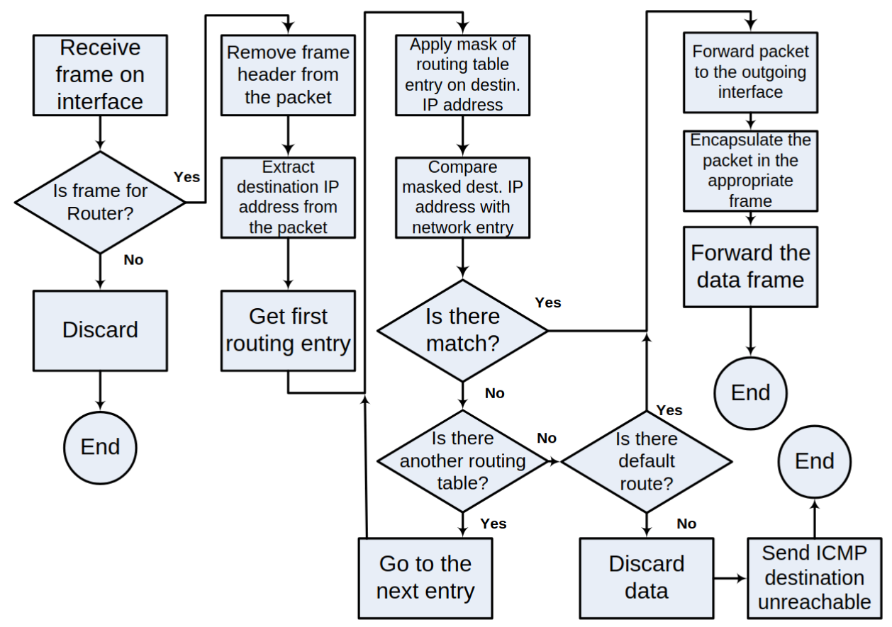
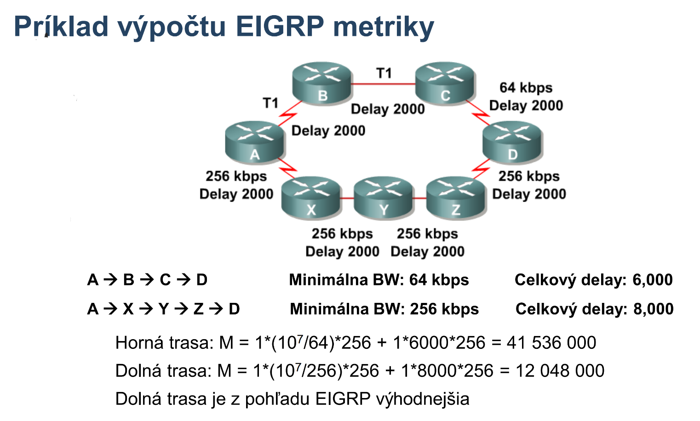

# PS2

Poznamocky k predmetu Pocitacove Siete 2

## Administrative distances

| Protokol                      |  AD |
| ----------------------------- | --: |
| Priamo pripojena siet         |   0 |
| Staticka siet                 |   1 |
| EIGRP sumarna siet            |   5 |
| BGP z ineho AS                |  20 |
| EIGRP interna siet            |  90 |
| OSPF                          | 110 |
| IS-IS                         | 115 |
| RIP                           | 120 |
| On-Demand Routing (ODR)       | 160 |
| BGP z toho isteho AS          | 200 |
| DHCP                          | 254 |
| Absolutne nedoveryhodny zdroj | 255 |

## Opakovanie

Smerovaci proces



Metody spracovania paketov

- Process switching
  - Kazdy paket prejde celym procesom smerovania
- Fast switching
  - Prvy paket do daneho ciela prejde celym procesom smerovania
  - Vysledok smerovania si router odlozi do tzv. "route cache", na zaklade coho budu smerovane dalsie pakety
- Cisco Express Forwarding (CEF)
  - Router si vysledky pre smerovanie pripravi dopredu

Smerovacie protokoly podla algoritmu

- Distance-vector
  - RIP, EIGRP
  - Celkovo jednoduchsie, vhodne pre mensie siete
  - Smerovace si vymienaju zoznam sieti a (z ich pohladu) najlepsie vzdialenosti do nich
  - Smerovace nepoznaju celu topologiu
  - Informacie ziskavaju od susedov
    - Periodicky (RIP + IGRP), aj ked sa nic nedeje (sluzi ako Keep-Alive)
    - Ked nastane zmena (Event-Driven) (EIGRP) - tabulka sa posle len na zaciatku a pri zmene, Keep-Alive pomocou Hello sprav
  - Spravy: vektory vzdialenosti
- Link-state
  - OSPF, IS-IS
  - Celkovo komplexnejsie, vhodne pre vacsie siete
  - Smerovace si vymienaju informacie pre tvorenie grafovej reprezentacie siete
  - Kazdy smerovac detailne pozna celu topologiu (lepsie, ale narocnejsie (CPU, RAM))
  - Link-state packets (LSP), Link-state databaza (LSDB)
  - Spravy: popisy prepojov
- Path-vector
  - BGP, MultiProtocol-BGP
  - Smerovace si vymienaju zoznam sieti a CESTU (namiesto vzdialenosti pri DV) od seba ku nim
  - Spravy: vektory atributov (t.j. polia)

Dalsie delenie smerovacich protokolov

- Interior Gateway Protocols (IGPs)
  - Smerovanie vo vnutri autonomneho systemu
  - RIP, EIGRP (Distance-vector) alebo OSPF, IS-IS (Link-state)
  - Pre IPv6 RIPng, EIGRP for IPv6, OSPFv3, IS-IS for IPv6
- Exterior Gateway Protocols (EGPs)
  - Smerovanie medzi jednotlivymi autonomnymi systemami
  - BGP (Path-vector)
  - Pre IPv6 BGP-MP

Metrika

- Ohodnotenie cesty do cielovej siete
- Ak do cielovej siete existuje viacej ciest, dany protokol vyberie tu najlepsiu na zaklade metriky
- Kazdy protokol si urcuje metriku inak
  - Protokoly pracujuce s jednym typom metriky
    - RIP - hops
    - OSPF - rychlost linky
  - Protokoly pracujuce s kompozitnou metrikou
    - EIGRP - rychlost + oneskorenie, volitelne aj zataz a spolahlivost

Administrativna vzdialenost

- "Doveryhodnost" smerovacieho protokolu
- Mozem mat nasadenych viacero protokolov ktore mi hlasia cestu do cielovej siete ale musim vybrat iba jeden - na zaklade metriky
- Cim nizsia metrika tym lepsie

## EIGRP

Enhanced Interior Gateway Routing Protocol  
Cisco Proprietary, zacina sa rozsirovat IETF open standardizacia  
Pokrocily classless distance-vector protokol (podla Cisco "hybridny", aj ked actually nie)  
Jediny distance-vector ktory garantuje bezsluckovost  
Automaticka aj manualna sumarizacia, autentifikacia, rychla konvergencia  
Je schopny zistit a pouzit backup route hned, aj bez komunikacie so susedmi  
Udrziava si tabulku o susedoch, pri zmene topo posle iba parcialnu spravu o zmene (na rozdiel od RIP - celu tabulku)  
Podla cisco vhodny aj do velkych sieti

Multicast `224.0.0.10` a `FF02::A`

Administrative distance

- Interne (vnutri autonomneho systemu): 90 (jedno z najnizsich)
- Externe: 170
- Sumarne polozky (discar routes, iba lokalne?): 5

Metrika - kompozitna - sklada sa z viac parametrov

### Vlastnosti

#### Protocol-dependent modules (PDM)

Ma nezavisle moduly - ked je treba (vyjde novy L3 protokol) tak sa dorobi modul do EIGRP a nemusi sa prerabat protokol sam o sebe  
Modul sa stara o format L3 adries, nie samotny protokol  
Cinnost EIGRP je rovnaka pre rozne L3 protokoly

#### Reliable Transport protocol (RTP)

Koncept (ani nie protokol, skor idea), ktory zabezpecuje spolahlivost  
Multicastom sa posielaju spravy

- Sused musi potvrdit prijatie spravy, inak sa nebudu posielat dalsie spravy
- Kazda sprava ma svoje sekvencne (poradove) cislo
- Ak sused potvrdi = _Conditional Receive_ = vsetko v poriadku
- Ak sused nepotrvrdi = _Laggard_ = pribrzdeny
  - Vyzaduje viacej komunikacie (unicast) kde sa snazia dobehnut to co sa stratilo
  - Ak aj tak dlho (`3x`) nepotrvrdi - vyhlasim za mrtveho (nasledne to oznamim aj susedom)

#### Udrziavanie vztahov so susedmi

Hello mechanizmus

- Pravidelne posielanie hello sprav (male, nenarocne, nepotrvrdzovane spravy) aby sa zistilo ci sused zije
  - Na pomalsich linkach (< ~1.5Mbps) kazdych 60 sekund
  - Na rychlejsich linkach kazdych 5 sekund
- Ak sused odpoveda, je zivy
- Ak sused neopovie 3-krat (15, resp. 180 sekund) -> vyhlasim ho za mrtveho -> zabudnem co poslal -> poslem update topo

Router si uklada "neighbor table" - `do show ip eight neighbors`  
Info sa prenasa iba ked nastane zmena v topo a iba medzi susedmi

Aby dvaja boli susedia, musia mat v pakete (co si vymenia) zhodne parametre:

- Cislo autonomneho systemu
- K-hodnoty (K-values) - vahove konstanty metriky, ktore pouzivaju
- Spolocna IP siet - adresa a maska

Ak susedia nie sme tak si nevymienaju routovacie tabulky  
Ziadny neighbor = ziadne routing info

### Pojmy v EIGRP

#### Reported Distance (RD)

Vzdialenost do siete, ktoru mi nahlasil sused  
Sused nareportoval ako je daleko do danej siete

#### Computed distance (CD)

Reported distance + moja vzdialenost k susedovi

#### Feasible Distance (FD)

(Celkom dolezity pojem)  
Doposial historicky najkratsia distance zo vsetkych CD (od poslednej zmeny nejakej linky Active -> Passive, resp. naopak)  
Najvyhodnejsia, resp. najkratsia cesta do cielovej siete  
CD mozu byt viacere, FD iba jedna  
Lokalna hodnota ktora nie je nikam ohlasovana  
Nemoze stupat (lebo by sa ohrozila bezsluckovost), moze iba klesat

Zmenit sa moze iba dvoma sposobmi

1. Smerovac sa dozvie o novej (kratsej) ceste do cielovej siete
2. Ak smerovac strati informaciu o ceste do cielovej siete a musi sa odznova spustit vypocet

#### Feasibility Condition (FC) - "RD < FD"

Zarucuje bezsluckovost  
RD < FD => nemoze obsahovat slucku  
Ak RD >= FD, tak je mozne ze sused routuje cezomna = slucka

Ak neplati FC -> moze/nemusi obsahovat slucku -> nemozeme priamo vlozit do tabulky

#### Successor a Feasible successor

Successor - next-hop router na ceste do najlepsej, najkratsej ceste do cielovej siete bez sluciek  
Feasible successor - backup Successor (tiez bez sluciek)  
Possible successor - nesplna FC - mozno vedie do cielovej siete, ale moze routovat cezomna takze moze mat slucky (ked nastane situacia kedy by sa mal pouzit tak sa ho opytam)

Pri zmene v sieti

- Ak je successor dostupny - nic sa nedeje, nic sa nezmeni
- Ak successor nie je dostupny
  - Ak mame Feasible successora tak ho hned pouzijeme -> bez vypadkov, rychla konvergencia, vsetci su happy
  - Ak nemame Feasible successora - musime znova spustit difuzny vypocet (potom sa tam zmeni aj FD (historicke minimum))

#### Diffusing computations

Generujem query na suseda reku "pocuvaj, ja som stratil cestu do cielovej siete (cezomna je to za nekonecno), vies o nej nieco?" a sused posle reply (bud jedno alebo druhe)

- "routujem cez teba, ak nevies ty cestu do cielovej siete tak ani ja neviem" alebo teda "cez teba za nekonecno = cezomna za nekonecno"
- Ak sused neroutoval cezo mna, tak z jeho pohladu sa nic nezmenilo takze mozem pouzit jeho, "jasne, cezomna za 20 (napr.)"

Mozem dalej pokracovat v routovani az ked dostanem odpovede na vsekty queries co som poslal. Ak mam 4 susedov, poslem 4 queries, musim dostat 4 odpovede  
Susedia sa tiez mozu pytat svojich susedov ak je taka situacia, cize to moze trvat dlhsie

Aby to nebolo take jednoduche, Feasible successor nemusi byt vzdy pouzity

- Povedzme ze cesta cez Feasible successora je za 25, a cez Possible successora za 20
- Router obetuje ten cas konvergencie a radsej sa spyta Possible successora ci sa da routovat cez neho (rychlejsia linka)

#### Neighbor table

Tabulka susedov  
Susedia si medzi sebou vymienaju routovacie tabulky  
Troubleshooting sa zacina prave tu!

#### Topology table

To, co dostanem od suseda  
Tabulka informacii o cielovych sietach a ich stave, FD, RD
Troubleshooting pokracuje tu!

#### Passive state & Active state

Paradoxne by som povedal ze to je naopak ale nevadi  
Passive - dobra route do cielovej siete, ktoru pouzivam  
Active - route ktora sa prepocitava a nesmie sa pouzivat (bezi difuzny vypocet)

### Metrika v EIGRP

Zklada sa z 6 parametrov (najcastejsie sa vyuzivaju prve dva)

- Bandwidth (staticky parameter, implicitne zapnuty)
- Delay (staticky parameter, implicitne zapnuty)
- Reliability (dynamicky vyhodnocovany, implicitne vypnuty)
- Load (dynamicky vyhodnocovany, implicitne vypnuty)
- MTU (staticky parameter, nevstupuje do vypoctov)
- Hop count (funguje len ako tvrdy limit na max dlzku cesty v hopoch)

| Paremeter   | Popis                                                                                                       | Staticky/Dynamicky parameter? | Implicitne zapnuty/vypnuty? |
| ----------- | ----------------------------------------------------------------------------------------------------------- | ----------------------------- | --------------------------- |
| Bandwidth   | Fyzicka priepustnost sietovej karty (`do show int g0/0`, tam napr. `BW1000000 Kbit/sec`)                    | Staticky                      | Zapnuty                     |
| Delay       | Natvrdo definovane oneskorenie interface-u (`do show int g0/0` tam napr. `DLY100` v desiatkach mikrosekund) | Staticky                      | Zapnuty                     |
| Reliability | Momentalna spolahlivost linky (`do show int g0/0`, tam napr. `reliability 255/255`)                         | Dynamicky                     | Vypnuty                     |
| Load        | Momentalna zataz linky (`do show int g0/0`, tam napr. `txload 1/255,  rxload 1/255`)                        | Dynamicky                     | Vypnuty                     |
| MTU         | Susedia musia mat rovnake                                                                                   | Staticky                      | _Nevstupuje do vypoctov_    |
| Hop count   | Iba hard limit na max dlzku                                                                                 | _-_                           | _-_                         |

Pri dynamickych je problem ze ako casto treba posielat updates, preto je by default off

#### Vypocet metriky

Metrika = $BW + \sum{ \forall D }$

- $BW$ - bandwidth = $\left( \dfrac{10^7 \text{ [Kbps]}}{\text{najpomalsie rozhranie [Kbps]}} \right) \cdot 256$
- $D$ - delay (v desiatkach mikrosekund) = $\sum{ \forall \text{ oneskorenia } [10 \mu s]} \cdot 256$

Mozu sa pouzit aj K-values - vaha pre kazdy parameter



### Load balancing

`equal-cost load balancing`

- Vie robit kazdy protokol
- Ak maju 2 routes rovnaku metriku tak medzi nimi robim LB

`unequal-cost load balancing`

- Vie iba EIGRP
- Kedze je metrika radovo v milionoch, je tazko trafit 2 rovnake metriky na LB
- Nastavi sa variance = koeficient, ktory hovori kolkokrat vacsia/mensia moze byt metrika s ktorou este budeme robit LB
- Basically nejaka odchylka
- Ak je metrika 2x horsia, pojde tou cestou 2x menej paketov

> Nie je to bug, je to feature

### Druhy EIGRP paketov

Vsetky EIGRP su "vtrepane do IP paketu, ktory je potom vtrepany do dalsieho L2 frame-u"  
Hlavicky su vsetky rovnake, meni sa telo paketu  
Podporuje TVL (Type Lenght Value), co znamena ze dlzka moze byt variabilna - viacej info naraz  
Druhe policko v hlavicke (opcode - operational code) urcuje typ paketu

Ak multicast, tak `224.0.0.10`, resp `FF02::10`

- Hello (Type 5)
  - Zistujem ci sused zije alebo nie
  - Nepotrvrdzovane
  - Multicast
  - Casto posielane (5, resp. 60 sekun)
- Update (Type 1)
  - Prenasaju smerovaciu informaciu - siet, maska, metrika
  - Multicast, pri spomenalych cez unicast
  - Su dolezite - musi byt potvrdzovany
- Query (Type 1)
  - Pytam sa na specificku cestu (ak som ja stratil informaciu o ceste)
  - Obvykle multicast
  - Potvrdzovane
- Reply (Type 4)
  - Odpoved na Query
  - Posiela sa unicast na adresu toho, kto sa pytal
  - Potvrdzovane
- Ack (Type 2)
  - Cez toto sa robi potvrdzovanie

### Default route

Neexistuje default route ako taka, treba workaround  
"Potom si dajte pozor, default route je uplne brutal"

```
ip route 0.0.0.0 0.0.0.0 serial0/1

redistribute static  # bud toto
network 0.0.0.0  # alebo toto
```

## OSPF

Link-state smerovaci protokol  
Pomerne casto sa pouziva  
Smerovanie vo vnutri sieti (autonomneho systemu)  
Event-Driven (nie az tak optimalizovany ako EIGRP)

Metrika - **cost** (`100 / Bandwidth`)

- V dnesnych sietach (1Gb+) by to znamenalo ze vzdy bude metrika 1
- Da sa zmenit

> T1 pri linke = 1.5 Mbps  
> Stav konvergencie = prepocitavam - nieco sa na sieti deje

OSPFv1 vs. OSPFv2 je nieco ako RIPv2 vs. RIPng  
Prikaz `OSPFv3` je prikaz na pomylenie - nieco s Cisco deamonom - nie je to iny protokol, len Cisco implementacia?

### Link-state

Smerovace si vymienaju parcialnu informaciu o topologii  
Reprezentovane grafom  
Strom najkratsich ciest  
Pamatovo aj vypoctovo narocnejsie  
Routre su identifikovane pomocou tzv. Router ID  
LSA, LSP  
Single-area, multi-area

### OSPF

Open Shortest Path First  
Najrozsirenejsi LS routing protocol  
Otvoreny protokol (RFC 2328)  
Classless, VLSM, lubovolna sumarizacia (iba na hraniciach oblasti!), autentifikacia, rychla konvergencia

Multicast

- `224.0.0.5` alebo `FF02::5`
- `224.0.0.6` alebo `FF02::6`

### Pojmy v OSPF

- Link - interface
- Link-state - informacie o linke (metrika, typ siete, ...)
- Link-state ID -
- Router ID
  - jedinecny identifikator kazdeho routra v topologickej oblasti
  - da sa zmenit prikazom `router id`
  - by default najvyssia IP spomedzi loopbacks
  - ak nie su loopbacks tak najvyssia IP zo vsetkych rozhrani
- Oblast (Area)
  - Identifikovana 4B cislom
  - Kazda oblast musi byt spojena s oblastou `0` (backbone)
  - Hranica oblasti je na routeri (nie na linke)
- Area Border Router (ABR)
  - Musi byt clenom oblasti `0`
- Autonomous System Border Router (ASBR)
  - Medzi AS a vonkajsim svetom
- Databazy v OSPF
  - LSBA
- Link-State Advertisements (LSAs)
  - Datova struktura, nie paket?
  - Viacej struktur sa moze zabalit do paketu a poslat
  - Popisuje linku
  - Je ich 12, pouziva sa 6, na CCNA budu 2
- Designated Router (DR)
  - "Ako nejaky boss"
  - Ostatne spravia vztah iba s tymto routerom, nie s ostatnymi
  - Komunikujem iba s nim
- Backup Designated Router (BDR)
  - Sleduje ci DR zije, ak zomre tak prevezme funkciu
- Vztahy smerovacov
  - Neighborhood - jednoduchsi, lahsi vztah
  - Adjacency - vaznejsi vztah

### OSPF packety

- Hello
  - Posiela sa kazdych 10 alebo 30 sekund
  - Dead interval `4 x hello interval`
- DBD (DDP)
  - Volba Master/Slave
- LSU
- LSR
- LSAck

Vkladane priamo do packetu  
Kazdy ma svoju vlastnu hlavicku

Prechody medzi stavmi

1. Down
1. Init
1. Two-Way
1. ExStart
1. Exchange
1. Loading
1. Full
