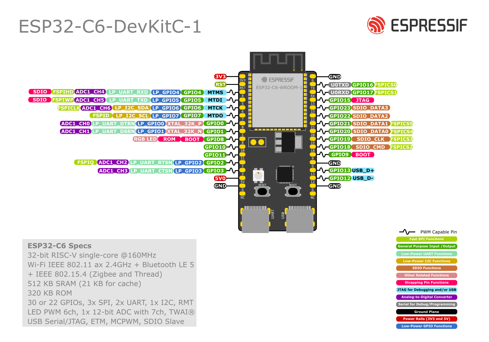

# VVS

## Hardware Terminologia

Procesor - jadro, ktore vykonava instrukcie, spracovava data  
Mikropocitac/mikrokontroler - procesor + pamate + periferie  
Cip - integrovany obvod  
System on Chip (SoC) - vacsina casti pocitaca je na cipe  
Modul - viac cipov na jednej doske  
System on Module - pocitac na module  
Kit, DevKit - modul + doplnky (napajanie, tlacidla, LED, ...)

## ESP32 serie

- Seria S2
  - 2019
  - Single core 32 bit CPU
  - 320 kB RAM, 4MB flash (1GB externa)
  - Len WiFi
- Seria S3
  - 2020
  - Dvojjadrovy 32 bit CPU
  - 512 kB RAM, 8MB flash (1GB externa)
  - Bluetooth 5 (BLE)
- Seria C3
  - 2020
  - 400kB SRAM, 4MB flash (1GB externa)
  - More suitable for IoT
- Seria C6
  - 2021
  - WiFi 6 (2.4GHz), Bluetooth 5.3, IEEE 802.15.4 (ZigBee)
- Seria C5
  - 2022
  - Aj 5GHz WiFi
- Seria H2
  - 2021
  - Thread, ZigBee, Bez WiFi
  - Ultra nizka spotreba

## GPIO

General Purpose Input-Output  
Vstupno-vystupny pin pre vseobecne pouzitie  
Digitalne vs. Analogove

ESP32-C6 pinout



24-26, 28-30 vyhradene pre externu Flash, nepouzivat  
6, 7, 12, 13, 16, 17 - pouzivat opartne (USB, JTAG, UART)  
4, 5, 8, 9, 15 - Strapping GPIO - config pri bootovani

> `Vdd` - vstupne napatie = `3.3V`

Vystup

- Logicka 0: `0` az `0.1 x Vdd`
- Logicka 1: `0.8 x Vdd` az `Vdd`

Vstup

- Logicka 0: `-0.3` az `0.25 x Vdd`
- Logicka 1: `0.75 x Vdd` az `Vdd + 0.3`

### Vystupy

> Logicka 1 `> 2.64V`  
> Logicka 0 `< 0.33V`

Max. zatazitelnost

- $I_{OH}$ = `40mA` - zdroj (source), default `20mA`
- $I_{OL}$ = `28mA` - spotrebic (sink)
- Celkovo vystup max `1000mA`
- Celkovo vstup max `> 500mA`

```python
# micropython
from machine import Pin

p1 = Pin(1, Pin.OUT)
p2 = Pin(1, Pin.OUT, value=1)
p3 = Pin(1, Pin.OUT, drive=Pin.DRIVE_3)  # max vykon = 40mA

# nastavenie hodnoty
p1.on()
p1.off()
p2.value(1)

# citanie hodnoty
x = p3.value()
```

```python
from machine import Pin
import time

r = Pin(25, Pin.OUT)
g = Pin(26, Pin.OUT)
b = Pin(27, Pin.OUT)

i = 0
while True:
    r.value(i&1)
    g.value(i&2)
    b.value(i&4)
    i = i+1
    time.sleep(1)
```

## PWM

Pulse Width Modulation

### Fejkovy PWM

LEDka velmo rychlo blika, co posobi ako keby menej svietila

```python
while True:
    r.on()
    time.sleep(1)

    for i in range(500):
        r.off()
        time.sleep_ms(1)
        r.on()
        time.sleep_ms(1)
```

```python
# vacsi rozdiel - viac vidno
while True:
    r.on()
    time.sleep(1)

    for i in range(100):
        r.off()
        time.sleep_ms(9)
        r.on()
        time.sleep_ms(1)
```

### Normalny PWM

$U_O = U_{max} \cdot \dfrac{T_{on}}{T}$

> $T$ = perioda  
> $T_{on}$ = kedy je zapnuta

Duty Cycle

Neda sa pouzit pri "pomalom" zariadeni (motor)

Caste spinanie = vacsie energeticke (?) straty (to nechceme)  
Idealne mimo pocutelnej oblasti (20kHz)

ESP32-C6 - 6 PWM kanalov, 4 casovace

```python
from machine import Pin, PWM

pwm = PWM(Pin(0), freq=5000, duty_u16=32768)
pwm.freq(1000)

pwm.duty(256)  # 0 - 1023
pwm.duty_u16(256)  # 0 - 65_535
pwm.duty_ns(25000)  # 0 - 1_000_000_000
pwm.deinit()
```

```python
pwm = PWM(Pin(10), freq=500, duty=100)

while True:
    time.sleep(1)
    pwm.duty(1023)
    time.sleep(1)
    pwm.duty(100)

# pwm.deinit()
```
